---
## Front matter
title: "Отчёт по лабораторной работе №1"
subtitle: "Операционные системы"
author: "Екатерина Павловна Канева"

## Generic otions
lang: ru-RU
toc-title: "Содержание"

## Bibliography
bibliography: bib/cite.bib
csl: pandoc/csl/gost-r-7-0-5-2008-numeric.csl

## Pdf output format
toc: true # Table of contents
toc-depth: 2
lof: true # List of figures
lot: true # List of tables
fontsize: 12pt
linestretch: 1.5
papersize: a4
documentclass: scrreprt
## I18n polyglossia
polyglossia-lang:
  name: russian
  options:
	- spelling=modern
	- babelshorthands=true
polyglossia-otherlangs:
  name: english
## I18n babel
babel-lang: russian
babel-otherlangs: english
## Fonts
mainfont: PT Serif
romanfont: PT Serif
sansfont: PT Sans
monofont: PT Mono
mainfontoptions: Ligatures=TeX
romanfontoptions: Ligatures=TeX
sansfontoptions: Ligatures=TeX,Scale=MatchLowercase
monofontoptions: Scale=MatchLowercase,Scale=0.9
## Biblatex
biblatex: true
biblio-style: "gost-numeric"
biblatexoptions:
  - parentracker=true
  - backend=biber
  - hyperref=auto
  - language=auto
  - autolang=other*
  - citestyle=gost-numeric
## Pandoc-crossref LaTeX customization
figureTitle: "Рис."
tableTitle: "Таблица"
listingTitle: "Листинг"
lofTitle: "Список иллюстраций"
lotTitle: "Список таблиц"
lolTitle: "Листинги"
## Misc options
indent: true
header-includes:
  - \usepackage{indentfirst}
  - \usepackage{float} # keep figures where there are in the text
  - \floatplacement{figure}{H} # keep figures where there are in the text
---

# Цель работы

Целью данной работы является приобретение практических навыков установки операционной системы на виртуальную машину, настройки минимально необходимых для дальнейшей работы сервисов.

# Задание

* Установка операционной системы на виртуальную машину.
* Настройка виртуальной машины.
* Получить следующую информацию:
 * Версия ядра Linux (Linux version).
 * Частота процессора (Detected Mhz processor).
 * Модель процессора (CPU0).
 * Объём доступной оперативной памяти (Memory available).
 * Тип обнаруженного гипервизора (Hypervisor detected).
 * Тип файловой системы корневого раздела.
 * Последовательность монтирования файловых систем.

# Выполнение лабораторной работы

## Лабораторная работа

Виртуальная машина была установлена и настроена в предыдущем семестре в рамках дисциплины "Архитектура компьютера", поэтому отчёт об установке операционной системы на виртуальную машину был уже готов (как и сама работа). Ниже приведены описание и скриншоты из того отчёта.

Работа выполнялась на персональном ноутбуке.

Предварительно было установлено дополнительно программное обеспечение – виртуальная машина Oracle VM VirtualBox (пакет Windows hosts с сайта в сети Интернет: [здесь](https://www.virtualbox.org/wiki/Downloads)) и образ необходимый образ операционной системы (Fedora 36: x86_64 Live ISO-образ с сайта в сети Интернет: [здесь](https://getfedora.org/ru/workstation/download/)). При установке виртуальной машины были выбраны предложенные системой параметры, поэтому снимки экрана приложены не будут.

Следующим шагом была запущена виртуальная машина Oracle VM VirtualBox (рис. [-@fig:001]):

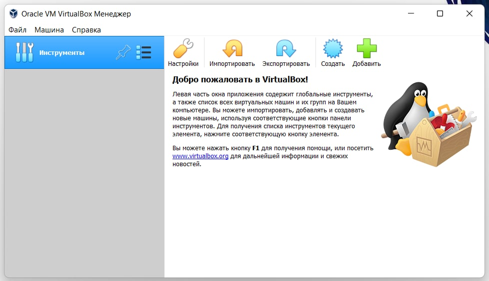{#fig:001 width=70%}

Далее была сменена хост-комбинация на `Ctrl+Alt` (рис. [-@fig:002]):

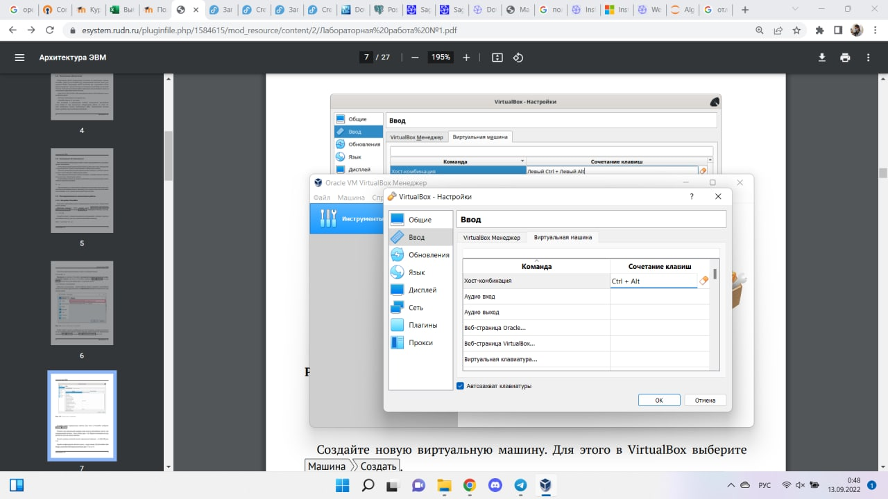{#fig:002 width=70%}

После этого была создана виртуальная машина, началась её настройка. В графе `Имя` был указан логин в дисплейном классе – `epkaneva`; в графе `Папка машины` путь к заранее созданному каталогу, соответствующему нужному пути в дисплейном классе – `\var\tmp\epkaneva`; в графе `Тип` – `Linux`; в графе `Версия` - `Fedora 64-bit` (рис. [-@fig:003]):

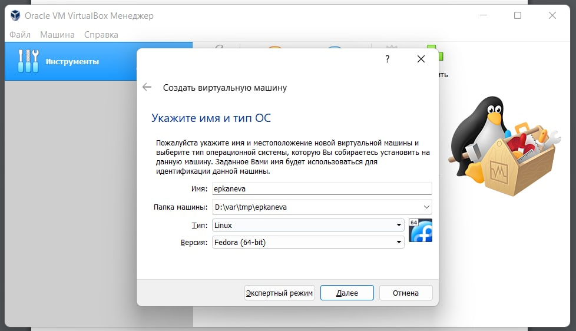{#fig:003 width=70%}

Далее был выбран объём памяти – 4096 Мб (рис. [-@fig:004]):

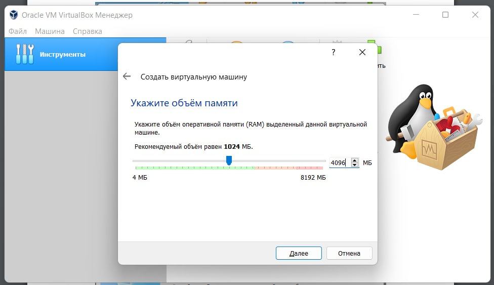{#fig:004 width=70%}

Далее был создан виртуальный жёсткий диск (рис. [-@fig:005]), выбран тип `VDI (VirtualBox Disk Image)` (рис. [-@fig:006]), выбран динамический тип жёсткого диска (рис. [-@fig:007]):

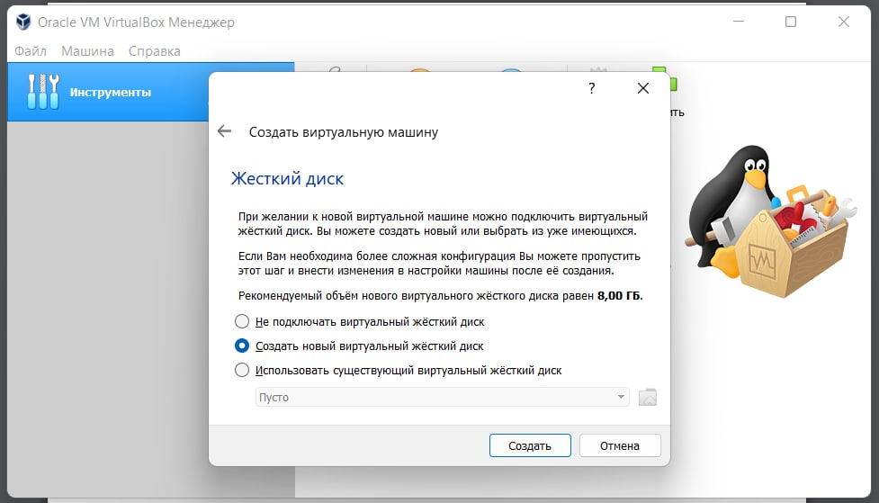{#fig:005 width=70%}

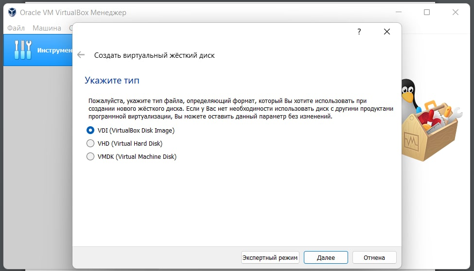{#fig:006 width=70%}

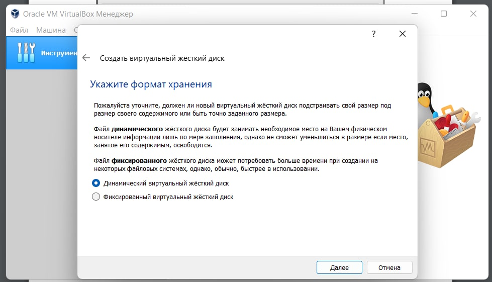{#fig:007 width=70%}

Далее для виртуального жёсткого диска был задан объём 80 Гб и выбран путь `/var/tmp/epkaneva/epkaneva.vdi` (рис. [-@fig:008]):

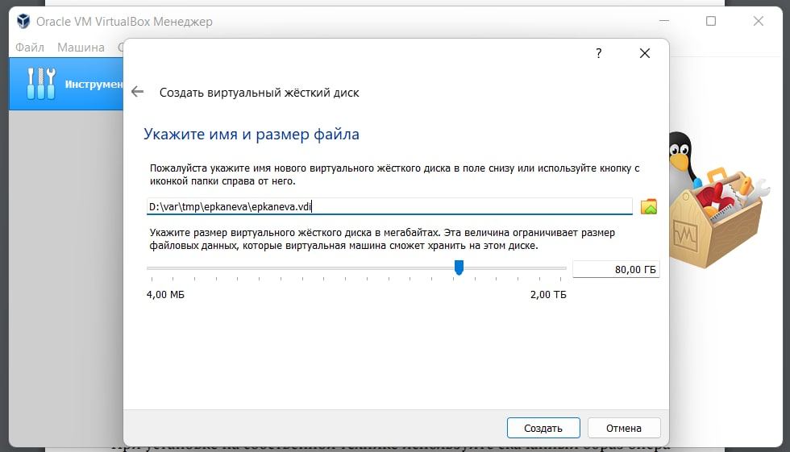{#fig:008 width=70%}

Далее был увеличен до 128 Мб доступный объём видеопамяти (рис. [-@fig:009]):

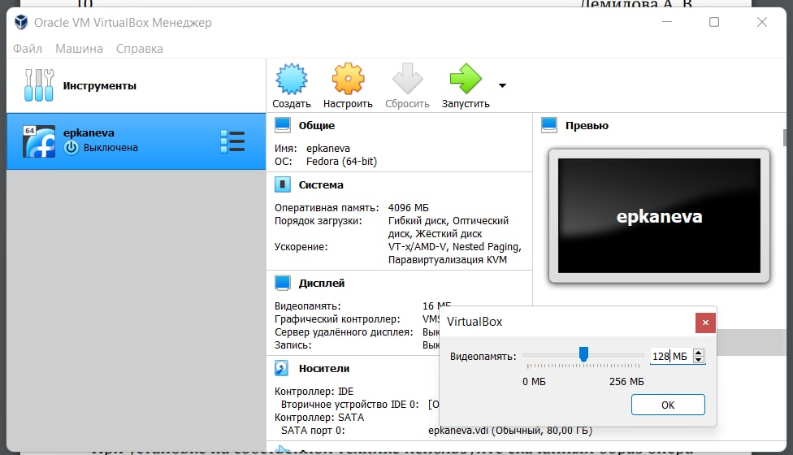{#fig:009 width=70%}

После этого был выбран образ жёсткого диска (рис. [-@fig:010] и [-@fig:011]):

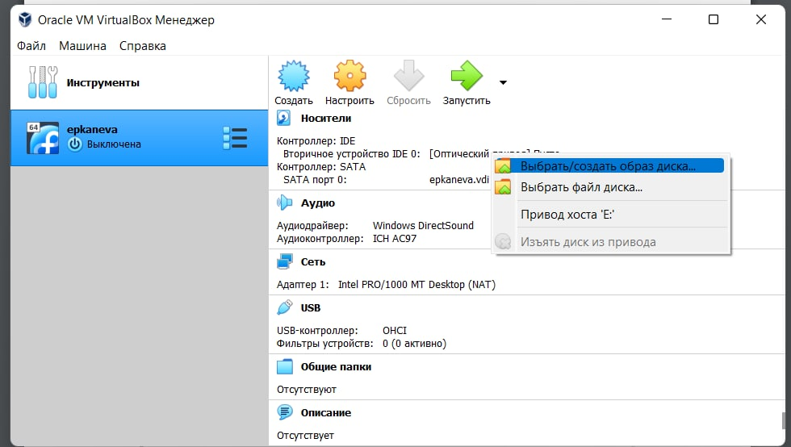{#fig:010 width=70%}

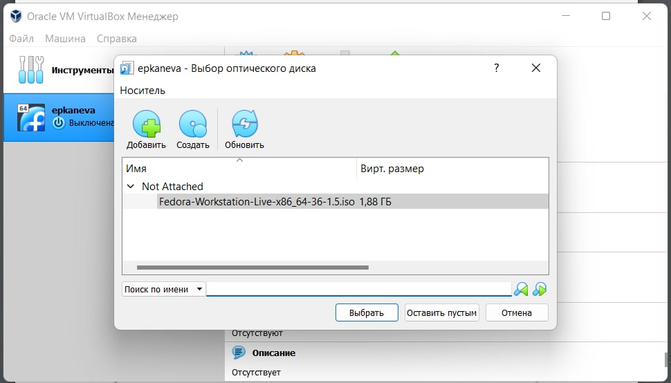{#fig:011 width=70%}

После завершения настройки виртуальная машина была запущена. Далее была запущена установка образа ОС - `Install to Hard Drive` (рис. [-@fig:012]):

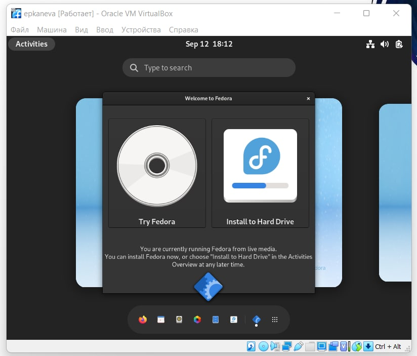{#fig:012 width=70%}

Далее запустился процесс установки. В качестве языка интерфейса был выбран английский язык (рис. [-@fig:013]). На этапе `Обзора установки` дата и время были установлены в соответствии с часовым поясом (рис. [-@fig:014]), в качестве языков клавиатуры установлены английский и русский (рис. [-@fig:015]), было проверено состояние жёсткого диска, на который выполняется установка (рис. [-@fig:016]).

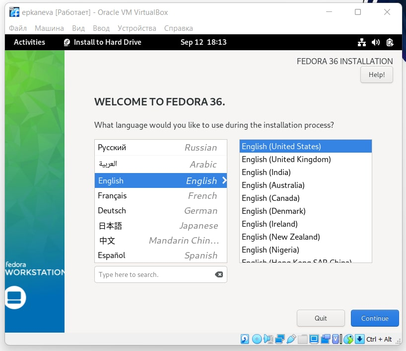{#fig:013 width=70%}

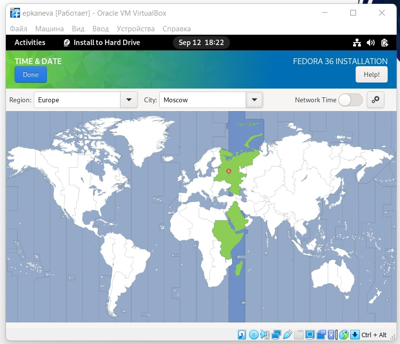{#fig:014 width=70%}

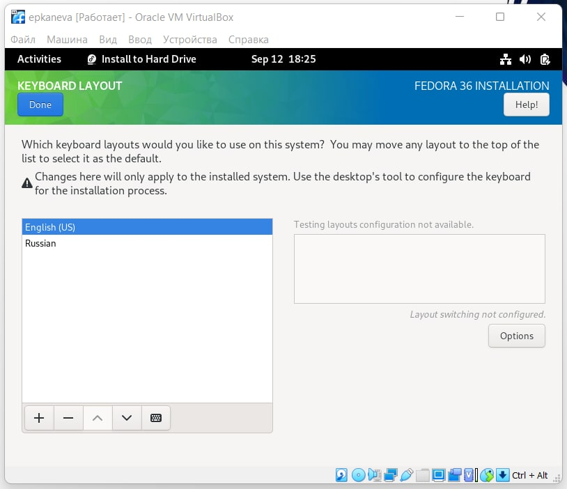{#fig:015 width=70%}

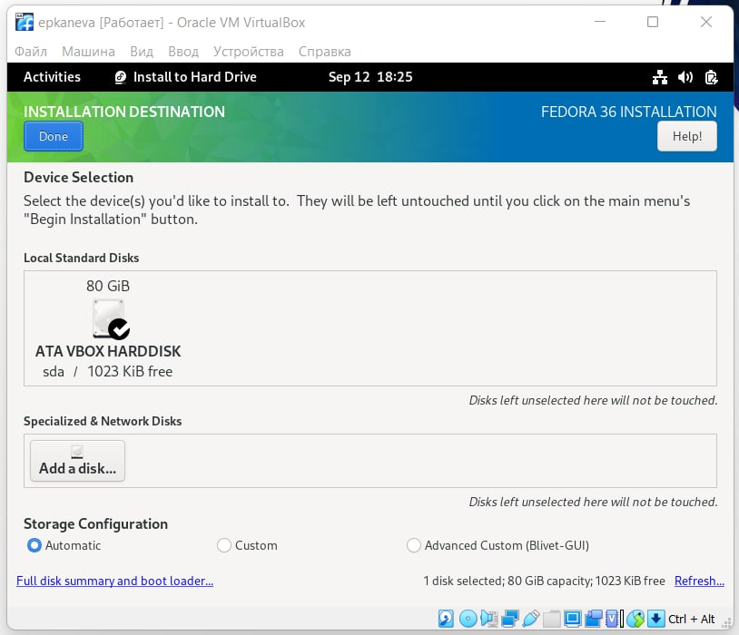{#fig:016 width=70%}

Далее была запущена установка. По завершении виртуальная машина была выключена, был извлечён образ жёсткого диска (рис. [-@fig:017]). После повторного включения были заданы имя, соответствующее логину в дисплейном классе (`epkaneva`), и пароль пользователя.

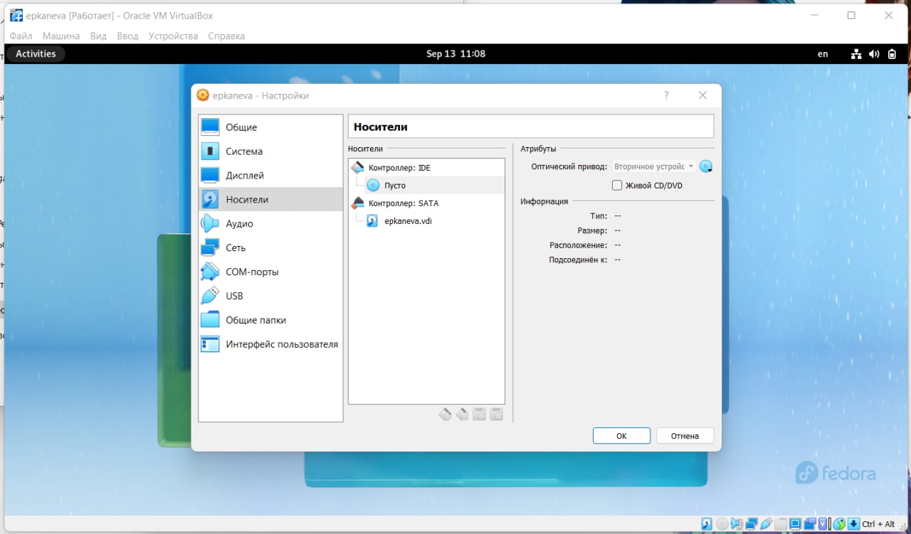{#fig:017 width=70%}

Образ ОС был успешно установлен на виртуальную машину, виртуальная машина запускается и работает корректно. 

В ходе выполнения более поздних лабораторных работ были установлены `pandoc` (нет снимков экрана, т.к. тогда ПК выключился в какой-то момент) и `texlive` (рис. [-@fig:018] и [-@fig:019]):

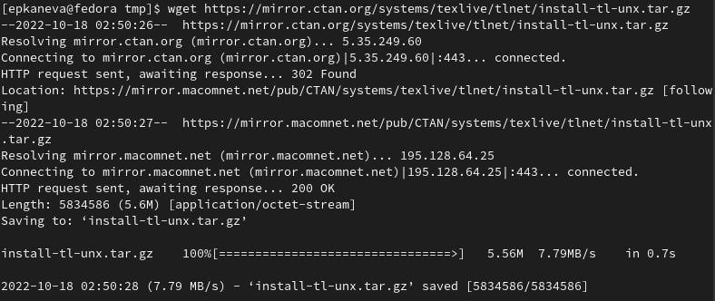{#fig:018 width=70%}

{#fig:019 width=70%}

Были также проверены имена пользователя, хоста виртуальной машины (рис. [-@fig:020]):

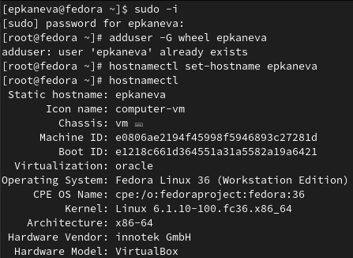{#fig:020 width=70%}

## Дополнительное задание

Далее была начата работа по выполнению "дополнительных заданий" (или "домашнего задания").

С помощью различных команд (в основном, `dmesg`) была получена следующая информация:

* Версия ядра Linux, т.е. Linux version (рис. [-@fig:021]):

```
dmesg | grep -i "Linux version"
```

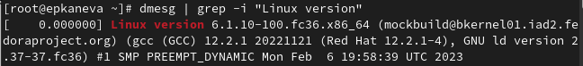{#fig:021 width=70%}

Видим, что ядро Linux ver. 6.1.10-100.fc36.x86_64 (86 архитектура, 64 бит).

* Частота процессора, т.е. Detected Mhz processor (рис. [-@fig:022]):

```
dmesg | grep -i "processor"
```

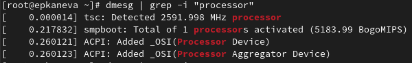{#fig:022 width=70%}

Частота процессора: 2591.998 (~2592) MHz.

* Модель процессора, т.е. CPU0 (рис. [-@fig:023]):

```
dmesg | grep -i "CPU0"
```

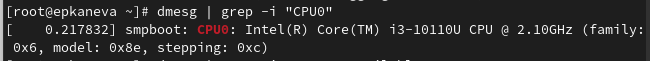{#fig:023 width=70%}

Модель процессора: Intel(R) Core(TM) i1-10110U.

* Объём доступной оперативной памяти, т.е. Memory available (рис. [-@fig:024]:

```
dmesg | grep -i "Memory"
```

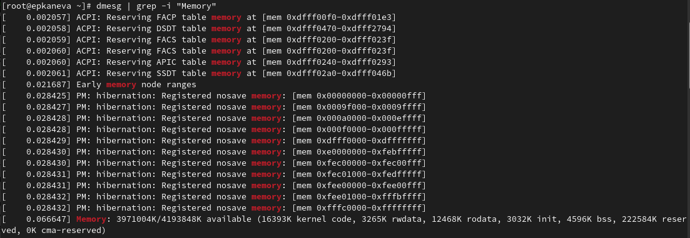{#fig:024 width=70%}

Памяти доступно: 3971004K (из 4193848K).

* Тип обнаруженного гипервизора, т.е. Hypervisor detected (рис. [-@fig:025]):

```
dmesg | grep -i "Hypervisor detected"
```

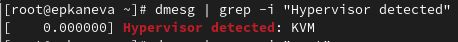{#fig:025 width=70%}

Тип гипервизора: KVM.

* Тип файловой системы корневого раздела (рис. [-@fig:026]). Для этого заходим в приложение `Disks`:

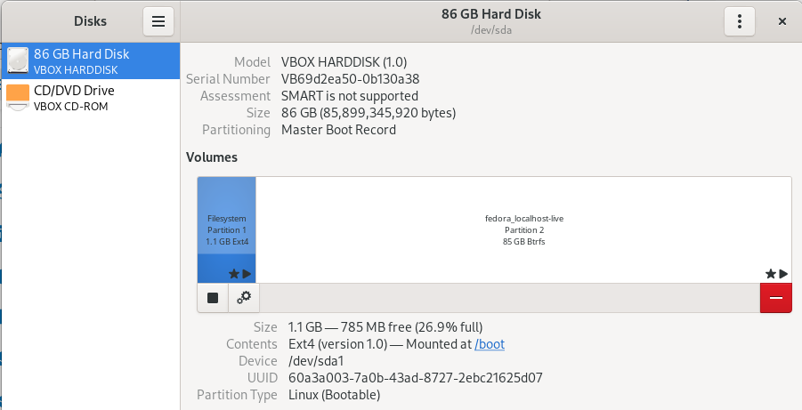{#fig:026 width=70%}

Тип: ext4.

* Последовательность монтирования файловых систем (рис. [-@fig:027]):

```
mount
```

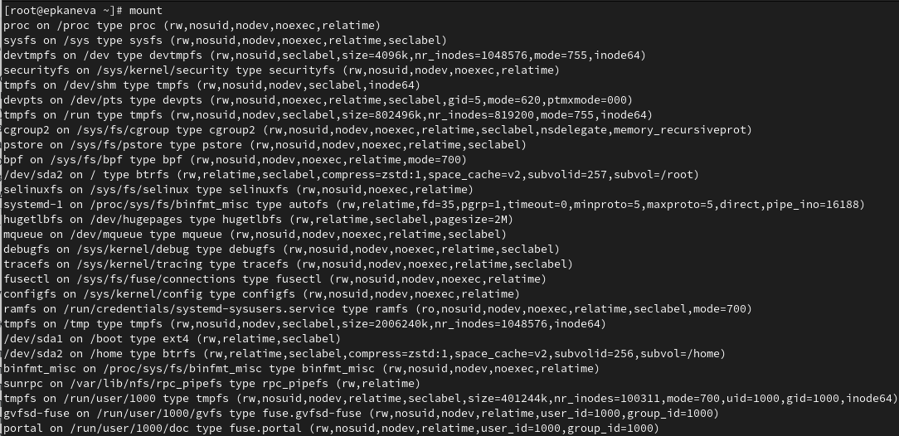{#fig:027 width=70%}

## Контрольные вопросы

1. Какую информацию содержит учётная запись пользователя?

Имя пользователя, зашифрованный пароль пользователя, идентификационный номер пользователя, идентификационный номер группы пользователя, домашний каталог, командный интерпретатор пользвателя.

2. Укажите команды терминала и приведите примеры:

 * для получения справки по команде: `man <command>` (`man cd`)

 * для перемещения по файловой системе: `cd <path>` (`cd work/study`)

 * для просмотра содержимого каталога: `ls` or `dir`

 * для определения объёма каталога: `du`

 * для создания каталогов: `mkdir <name>` (`mkdir lab01`)
 
 * для удаления каталогов: `rm <name>` (`rm -r lab01`)

 * для создания файлов: `touch <name>` (`touch lab01.md`)

 * для удаления файлов: `rm -r <name>` (`rm lab01.md`)

 * для задания определённых прав на файл / каталог: `chmod + x <name/path>` (`chmod + x lab01`)

 * для просмотра истории команд: `history`.
 
3. Что такое файловая система? Приведите примеры с краткой характеристикой.

Файловая система -- это порядок, определяющий способ организации, хранения и именования данных на носителях информации в компьютерах, а также в другом электронном оборудовании.

Примеры файловых систем:

* Журналируемая файловая система (JFS). Журналируемые файловые системы позволяют быстро восстанавливать данные в случае сбоя. Это достигается за счет ведения журнала изменений файлов.
* Файловая система на компакт-диске. Это файловая система, которая хранится на компакт-диске и доступна только для чтения.
* Файловая система RAM. Диск RAM -- это виртуальный жесткий диск, хранящийся в оперативной памяти.
* Сетевая файловая система (NFS). Сетевая файловая система, или NFS, -- это распределенная файловая система, предоставляющая доступ к файлам и каталогам, хранящимся в удаленных системах, обычными средствами для работы с локальными файлами. 
* Система имен файлов (NameFS). Система имен файлов содержит функции монтирования файл-на-файл и каталог-на-каталог (также называемое слабое монтирование), которые позволяют монтировать подкаталог или файловую систему в другом месте в области имен файлов, что позволяет иметь доступ к файлу с помощью двух различных путей.

4. Как посмотреть, какие файловые системы подмонтированы в ОС?

С помощью команды `mount`.

5. Как удалить зависший процесс?

с помощью команды `kill`.

# Выводы

Установили ОС на виртуальную машину и настроили минимально необходимые для дальнейшей работы программы и сервисы. Узнали дополнительную информацию о машине.
