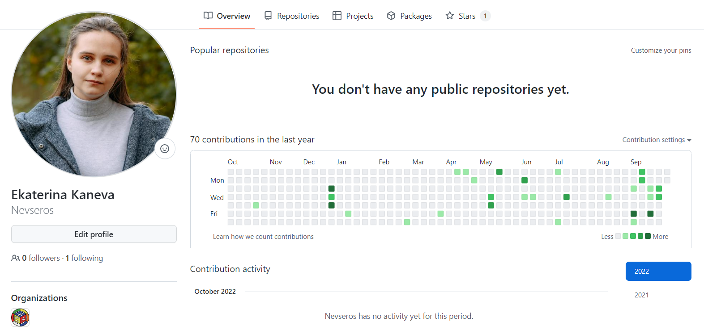
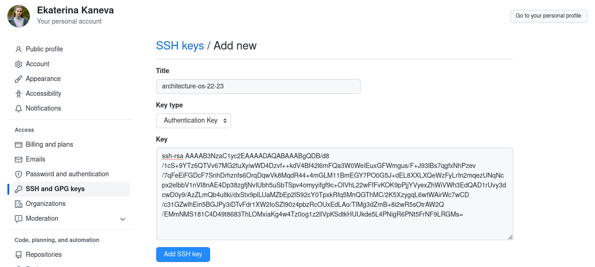
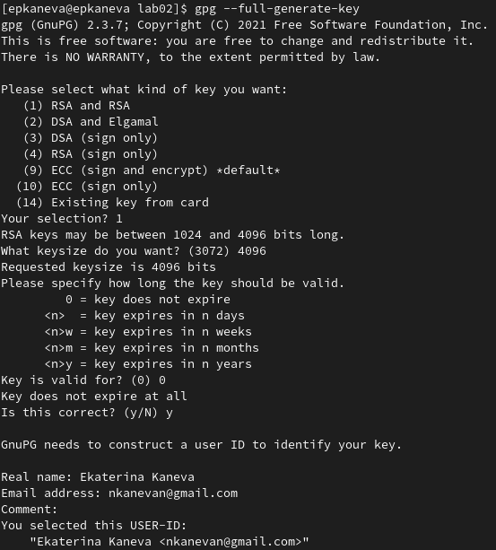
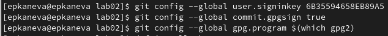

---
## Front matter
lang: ru-RU
title: Лабораторная работа №2
subtitle: Операционные системы
author:
  - Канева Е.П., НКАбд-02-22

## i18n babel
babel-lang: russian
babel-otherlangs: english

## Formatting pdf
toc: false
toc-title: Содержание
slide_level: 2
aspectratio: 169
section-titles: true
theme: metropolis
header-includes:
 - \metroset{progressbar=frametitle,sectionpage=progressbar,numbering=fraction}
 - '\makeatletter'
 - '\beamer@ignorenonframefalse'
 - '\makeatother'
---

# Вводная часть

## Цель работы

* Изучить идеологию и применение средств контроля версий.
* Освоить умения по работе с git.

# Выполнение лабораторной работы 

## Настройка github и git

Предварительно были настроены gihhub и git (при выполнении похожей лабораторной работы в предыдущем семестре):

{width=70%}

## Настройка github и git

{width=70%}

## Создание SSH ключа

Был создан SSH ключ, он был также добавлен в аккаунт на github:

{width=70%}

## Создание SSH ключа

{width=70%}

## Создание рабочего простанства

Было создано рабочее пространство (с помощью шаблона), были использованы следующие команды:

```
mkdir -p ~/work/study/2022-2023/«Операционные системы»
cd ~/work/study/2022-2023/"Операционные системы"
git clone --recursive git@github.com:Nevseros/study_2022–2023_os-intro.git os-intro
```

## Удаление ненужных файлов и формирование пространства

Чтобы закончить создание пространства, были выполнены следующие команды:

```
rm package.json
echo os-intro > COURSE
make
git add . 
git commit -am 'feat(main): make course structure' 
git push
```

## Генерация GPG ключа

Для большей безопасности был сгенерирован GPG ключ:

{width=40%}

## Настройка автоматических подписей коммитов

Были настроены автоматические подписи коммитов:

{width=70%}

# Заключение

## Выводы

Изучили идеологию и применение системы контроля версий. Приобрели практические навыки работы с системой git. 
