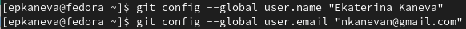

---
## Front matter
title: "Отчёт по лабораторной работе №2"
subtitle: "Операционные системы"
author: "Екатерина Павловна Канева"

## Generic otions
lang: ru-RU
toc-title: "Содержание"

## Bibliography
bibliography: bib/cite.bib
csl: pandoc/csl/gost-r-7-0-5-2008-numeric.csl

## Pdf output format
toc: true # Table of contents
toc-depth: 2
lof: true # List of figures
lot: true # List of tables
fontsize: 12pt
linestretch: 1.5
papersize: a4
documentclass: scrreprt
## I18n polyglossia
polyglossia-lang:
  name: russian
  options:
	- spelling=modern
	- babelshorthands=true
polyglossia-otherlangs:
  name: english
## I18n babel
babel-lang: russian
babel-otherlangs: english
## Fonts
mainfont: PT Serif
romanfont: PT Serif
sansfont: PT Sans
monofont: PT Mono
mainfontoptions: Ligatures=TeX
romanfontoptions: Ligatures=TeX
sansfontoptions: Ligatures=TeX,Scale=MatchLowercase
monofontoptions: Scale=MatchLowercase,Scale=0.9
## Biblatex
biblatex: true
biblio-style: "gost-numeric"
biblatexoptions:
  - parentracker=true
  - backend=biber
  - hyperref=auto
  - language=auto
  - autolang=other*
  - citestyle=gost-numeric
## Pandoc-crossref LaTeX customization
figureTitle: "Рис."
tableTitle: "Таблица"
listingTitle: "Листинг"
lofTitle: "Список иллюстраций"
lotTitle: "Список таблиц"
lolTitle: "Листинги"
## Misc options
indent: true
header-includes:
  - \usepackage{indentfirst}
  - \usepackage{float} # keep figures where there are in the text
  - \floatplacement{figure}{H} # keep figures where there are in the text
---

# Цель работы

* Изучить идеологию и применение средств контроля версий.
* Освоить умения по работе с git.

# Выполнение лабораторной работы

## Настройка  GitHub

Предварительно мною уже был создан аккаунт на сайте https://github.com, а также была заполнена основная информация (рис. [-@fig:fig001]):

{#fig:fig001 width=70%}

## Базовая настройка git.

Сначала сделаем предварительную конфигурацию git. Откроем терминал и введём следующие команды, указав свои имя и email (рис. [-@fig:fig002]):

```
git config --global user.name "Ekaterina Kaneva" 
git config --global user.email "nkanevan@gmail.com"
```

{#fig:fig002 width=70%}

Настроим utf-8 в выводе сообщений git (рис. [-@fig:fig003]): 

```
git config --global core.quotepath false 
```

{#fig:fig003 width=70%}

Зададим имя начальной ветки – master (рис. [-@fig:fig004]): 

```
git config --global init.defaultBranch master
```

{#fig:fig004 width=70%}

Параметр autocrlf (рис. [-@fig:fig005]) и safecrlf (рис. [-@fig:fig006]):

```
git config --global core.autocrlf input
git config --global core.safecrlf warn
```

{#fig:fig005 width=70%}

{#fig:fig006 width=70%}

## Создание SSH ключа.

Для последующей идентификации на сервере репозиториев сгенерируем пару ключей – приватный и открытый (рис. [-@fig:fig007]):

```
ssh-keygen -C "Ekaterina Kaneva nkanevan@gmail.com"
```

{#fig:fig007 width=70%}

Далее, чтобы добавить новый сгенерированный ключ, авторизуемся на сайте github.org и введём новый ключ в настройках. Чтобы скопировать ключ, в консоль введём следующую команду, а затем скопируем ключ (рис. [-@fig:fig008]):

```
cat ~/.ssh/id_rsa.pub
```

{#fig:fig008 width=70%}

Теперь добавим ключ (рис. [-@fig:fig009]):

{#fig:fig009 width=70%}

## Создание рабочего пространства и репозитория курса на основе шаблона.

При выполнении первой лабораторной работы было создано рабочее пространство для предмета "Операционные системы" с помощью команды:

```
mkdir -p ~/work/study/2022-2023/«Операционные системы»
```

Используем указанный в тексте лабораторной работы шаблон для собственного репозитория (рис. [-@fig:fig011]):

{#fig:fig011 width=70%}

В открывшемся окне зададим имя репозитория study_2022-2023_os-intro и создадим репозиторий.

Откроем терминал, перейдём в каталог курса и клонируем репозиторий с помощью следующих команд:
 
```
cd ~/work/study/2022-2023/"Операционные системы"
git clone --recursive git@github.com:Nevseros/study_2022–2023_os-intro.git os-intro
```

## Настройка каталога курса

Удалим лишние файлы и создадим необходимые каталоги. Отправим файлы на сервер (всё это делалось перед выполнением первой лабораторной, поэтому скриншотов ввода команд в терминале нет:

```
rm package.json
echo os-intro > COURSE
make
git add . 
git commit -am 'feat(main): make course structure' 
git push
```

Теперь проверим, что файлы действительно отправились на сервер (рис. [-@fig:fig019]):

{#fig:fig019 width=70%}

Далее началось выполнение новой части лабораторной работы - был сгенерирован gpg ключ. Для этого была введена следующая команда (рис. [-@fig:020] и [-@fig:021]):

{#fig:020 width=70%}

{#fig:021 width=70%}

Далее для экспорта ключа была введена команда:

```
gpg --armor --export 6B35594658EB89A5
```

Где `6B35594658EB89A5` -- отпечаток ключа.

{#fig:023 width=70%}

Позже этот ключ был введён на сайте github (рис. [-@fig:024]):

{#fig:024 width=70%}

Были настроены автоматические подписи коммитов (рис. [-@fig:026]):

{#fig:026 width=70%}

Неверифицированные коммиты теперь выделяются (рис. [-@fig:027]):

{#fig:027 width=70%}

Также был выполнен вход в gh (рис. [-@fig:025]):

{#fig:025 width=70%}

## Контрольные вопросы

1. Что такое системы контроля версий (VCS) и для решения каких задач они предназначаются?

Система контроля версий -- это программное обеспечение для облегчения работы с изменяющейся информацией. Система управления версиями позволяет хранить несколько версий одного и того же документа, при необходимости возвращаться к более ранним версиям, определять, кто и когда сделал то или иное изменение, и многое другое.

Такие системы наиболее широко используются при разработке программного обеспечения для хранения исходных кодов разрабатываемой программы. Однако они могут с успехом применяться и в других областях, в которых ведётся работа с большим количеством непрерывно изменяющихся электронных документов.

2. Объясните следующие понятия VCS и их отношения: хранилище, commit, история, рабочая копия.

Хранилище -- репозиторий, в нём хранятся все документы, история их изменений и другая служебная информация.

commit -- добавленные изменения.

История хранит все изменения в проекте и позволяет обратиться к нужным версиям документов.

Рабочая копия -- текущее состояние файлов проекта.

3. Что представляют собой и чем отличаются централизованные и децентрализованные VCS? Приведите примеры VCS каждого вида.

Централизованные системы контроля версий предполагают наличие централизованного хранилища, а пользователи сами копируют все необходимые файлы к себе, добавляют изменения и отправляют их на централизованный репозиторий. Например, CVS, TFS.

Децентрализованные системы предполагают наличие у каждого пользователя своеге репозитория (а может и не одного), изменения можно получить из любого из таких репозиториев. Например, Git, Bazaar.

4. Опишите действия с VCS при единоличной работе с хранилищем.

Создаём репозиторий, по мере изменения проекта отправляем изменения (коммиты) на сервер (удалённый резозиторий).

5. Опишите порядок работы с общим хранилищем VCS.

Перед тем, как начинать изменять проект, надо получить актуальную версию. Затем можно вносить изменения, отправлять их на удалённый репозиторий.

6. Каковы основные задачи, решаемые инструментальным средством git?

Хранение файлов проекта и истории их изменения, а также удобство командной работы над проектами.

7. Назовите и дайте краткую характеристику командам git.

* Создание основного дерева репозитория:

`git init`

* Получение обновлений (изменений) текущего дерева из центрального репозитория:

`git pull`

* Отправка всех произведённых изменений локального дерева в центральный репозиторий:

`git push`

* Просмотр списка изменённых файлов в текущей директории:

`git status`

* Просмотр текущих изменений:

`git diff`

* Сохранение текущих изменений:

 * добавить все изменённые и/или созданные файлы и/или каталоги:

`git add .`

 * добавить конкретные изменённые и/или созданные файлы и/или каталоги:

`git add имена_файлов`

 * удалить файл и/или каталог из индекса репозитория (при этом файл и/или каталог остаётся в локальной директории):

`git rm имена_файлов`

* Сохранение добавленных изменений:

 * сохранить все добавленные изменения и все изменённые файлы:

`git commit -am 'Описание коммита'`

 * сохранить добавленные изменения с внесением комментария через встроенный редактор:

`git commit`

 * создание новой ветки, базирующейся на текущей:

`git checkout -b имя_ветки`

`git switch -c`

 * переключение на некоторую ветку:

`git checkout имя_ветки`

`git switch`

 * отправка изменений конкретной ветки в центральный репозиторий:

`git push origin имя_ветки`

 * слияние ветки с текущим деревом:

`git merge имя_ветки`

* Удаление ветки:

 * удаление локальной уже слитой с основным деревом ветки:

`git branch -d имя_ветки`

 * принудительное удаление локальной ветки:

`git branch -D имя_ветки`

 * удаление ветки с центрального репозитория:

`git push origin :имя_ветки`

* Переключение на старые коммиты:

 * новым коммитом (можно отменить):
 
`git revert имя_коммита`
 
 * без нового коммита
 
`git reset --hard имя_коммита`

8. Приведите примеры использования при работе с локальным и удалённым репозиториями.

Например, в каком-либо проекте внесли изменения в файлы, теперь нужно их отправить на сервер. Предварительно, перед внесением изменений, притянем изменения с удалённого репозитория, потом создадим новую ветку под нашу (допустим) feature, чтобы потом открыть pull request на github (или merge request, если gitlab):

```
git pull
git switch -c feature/redirect
git add .
git commit -m 'Add redirect route'
git push --set-upstream origin feature/redirect
```

После этого в удалённом репозитории появится вохможность открыть pull/merge request. Там, по необходимости, нужно будет дождаться фидбэка от других контрибьюторов, решить конфликты веток, если таковые есть, а потом влить изменения.

9. Что такое и зачем могут быть нужны ветви (branches)?

Ветви -- параллельные участки истории. Нужны, чтобы работать над разными заданиями одновременно, а также чтобы удобнее было работать нескольким людям над одним проектом, чтобы можно было открывать pull/merge request'ы и получать ревью кода.

10. Как и зачем можно игнорировать некоторые файлы при commit?

Во время работы над проектом могут появляться ненужные файлы (например, какие-то временные файлы создаваемые редакторами или объектные файлы, создаваемые компиляторами). Их можно игнорировать с помощью `.gitignore` (специальный файл в репозитории). Можно также использовать команду `git reset HEAD имя_файла`, чтобы исключить его из текущего коммита (после `git add`).

# Выводы

Изучили идеологию и применение системы контроля версий. Приобрели практические навыки работы с системой git. 
