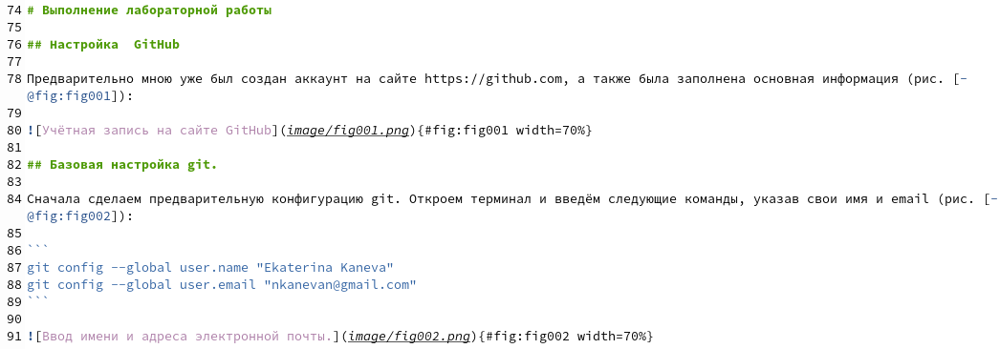
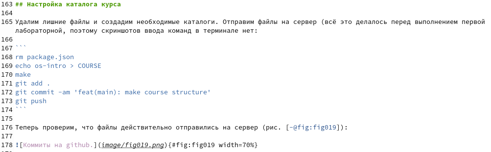

---
## Front matter
lang: ru-RU
title: Лабораторная работа №3
subtitle: Операционные системы
author:
  - Канева Е.П., НКАбд-02-22

## i18n babel
babel-lang: russian
babel-otherlangs: english

## Formatting pdf
toc: false
toc-title: Содержание
slide_level: 2
aspectratio: 169
section-titles: true
theme: metropolis
header-includes:
 - \metroset{progressbar=frametitle,sectionpage=progressbar,numbering=fraction}
 - '\makeatletter'
 - '\beamer@ignorenonframefalse'
 - '\makeatother'
---

# Вводная часть

## Цель работы

Научиться оформлять отчёты с помощью легковесного языка разметки Markdown.

## Задачи

- Сделайте отчёт по предыдущей лабораторной работе в формате Markdown.
- В качестве отчёта просьба предоставить отчёты в 3 форматах: pdf, docx и md (в архиве, поскольку он должен содержать скриншоты, Makefile и т.д.).

# Выполнение лабораторной работы

## Составление отчёта

Отчёт в формате Markdown был составлен при подготовке отчёта к предыдущей лабораторной работе. Вот фрагмен начала отчёта (рис. [-@fig:001]):

{#fig:001 width=70%}

## Составление отчёта

Ниже --- фрагмент, описывающий настройку каталога курса (рис. [-@fig:002]):

{#fig:002 width=70%}

# Заключительная часть

## Выводы

Научились оформлять отчёты с помощью легковесного языка разметки Markdown. Оформили отчёт предыдущей лаюораторной работы в формате Markdown.
