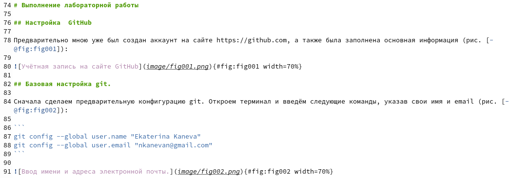
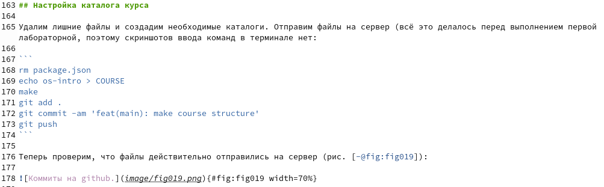

---
## Front matter
title: "Лабораторная работа №3"
subtitle: "Операционные системы"
author: "Екатерина Павловна Канева"

## Generic otions
lang: ru-RU
toc-title: "Содержание"

## Bibliography
bibliography: bib/cite.bib
csl: pandoc/csl/gost-r-7-0-5-2008-numeric.csl

## Pdf output format
toc: true # Table of contents
toc-depth: 2
lof: true # List of figures
lot: true # List of tables
fontsize: 12pt
linestretch: 1.5
papersize: a4
documentclass: scrreprt
## I18n polyglossia
polyglossia-lang:
  name: russian
  options:
	- spelling=modern
	- babelshorthands=true
polyglossia-otherlangs:
  name: english
## I18n babel
babel-lang: russian
babel-otherlangs: english
## Fonts
mainfont: PT Serif
romanfont: PT Serif
sansfont: PT Sans
monofont: PT Mono
mainfontoptions: Ligatures=TeX
romanfontoptions: Ligatures=TeX
sansfontoptions: Ligatures=TeX,Scale=MatchLowercase
monofontoptions: Scale=MatchLowercase,Scale=0.9
## Biblatex
biblatex: true
biblio-style: "gost-numeric"
biblatexoptions:
  - parentracker=true
  - backend=biber
  - hyperref=auto
  - language=auto
  - autolang=other*
  - citestyle=gost-numeric
## Pandoc-crossref LaTeX customization
figureTitle: "Рис."
tableTitle: "Таблица"
listingTitle: "Листинг"
lofTitle: "Список иллюстраций"
lotTitle: "Список таблиц"
lolTitle: "Листинги"
## Misc options
indent: true
header-includes:
  - \usepackage{indentfirst}
  - \usepackage{float} # keep figures where there are in the text
  - \floatplacement{figure}{H} # keep figures where there are in the text
---

# Цель работы

Научиться оформлять отчёты с помощью легковесного языка разметки Markdown.

# Задание

- Сделайте отчёт по предыдущей лабораторной работе в формате Markdown.
- В качестве отчёта просьба предоставить отчёты в 3 форматах: pdf, docx и md (в архиве, поскольку он должен содержать скриншоты, Makefile и т.д.).

# Теоретическое введение

### **Базовые сведения о Markdown**

Чтобы создать заголовок, неоюходимо использовать знак #, например:

```
1. # This is heading 1
2. ## This is heading 2
3. ### This is heading 3
4. #### This is heading 4
```

Чтобы задать для текста полужирное начертание, необходимо заключить его в двойные звёздочки:

```
This text is **bold** 
```

Чтобы задать для текста курсивное начертание, необходимо заключить его в одинарные звёздочки:

```
This text is *italic* 
```

Чтобы задать для текста полужирное и курсивное начертание, заключите его в тройные
звездочки:

```
This is text is both ***bold and italic*** 
```

Блоки цитирования создаются с помощью символа >:

```
> The drought had lasted now for ten million years, and the reign of the terrible lizards had long since ended.
```

Неупорядоченный (маркированный) список можно отформатировать с помощью звездочек или тире:

```
- List item 1
- List item 2
- List item 3
```

Чтобы вложить один список в другой, необходимо добавить отступ для элементов дочернего списка:

```
- List item 1
   - List item A
   - List item B
- List item 2
```

Упорядоченный список можно отформатировать с помощью соответствующих цифр:

```
 1. First instruction
 2. Second instruction
 3. Third instruction
```

Чтобы вложить один список в другой, необходимо добавить отступ для элементов дочернего списка:

```
1. First instruction
    1. Sub-instruction
    1. Sub-instruction
1. Second instruction
```

 Синтаксис Markdown для встроенной ссылки состоит из части [link text] , представляющей текст гиперссылки, и части (file-name.md) – URL адреса или имени файла, на который дается ссылка:

```
[link text](file-name.md)
```

Markdown поддерживает как встраивание фрагментов кода в предложение, так и их размещение между предложениями в виде отдельных огражденных блоков. Огражденные блоки кода — это простой способ выделить синтаксис для фрагментов кода. Общий формат огражденных блоков кода:

```language
 your code goes in here
```

Внутритекстовые формулы делаются аналогично формулам LaTeX. Например:

```
$\sin^2 (x) + \cos^2 (x) = 1$
```

### Оформление изображений в Markdown

В Markdown вставить изображение в документ можно с помощью непосредственного указания адреса изображения. Синтаксис данной команды выглядит следующим образом:

```
{#fig:fig1 width=70%}
```
Здесь:
* в квадратных скобках указывается подпись к изображению;
* в круглых скобках указывается URL-адрес или относительный путь изображения, а также (необязательно) всплывающую подсказку, заключённую в двойные или одиночные кавычки;
* в фигурных скобках указывается идентификатор изображения `(#fig:fig1)` для ссылки на него по тексту и размер изображения относительно ширины страницы `{width=70%}`.

Ссылка на изображение (рис. 4.1) может быть оформлена следующим образом `(рис. [-@fig:fig1])`.

### Обработка файлов в формате Markdown

Преобразовать файл README.md можно следующим образом:

```
pandoc README.md -o README.pdf
```

или так

```
pandoc README.md -o README.docx
```

Для компиляции отчетов по лабораторным работам предлагается использовать следующий Makefile

```
FILES = $(patsubst %.md, %.docx, $(wildcard *.md))
FILES += $(patsubst %.md, %.pdf, $(wildcard *.md))
LATEX_FORMAT =
FILTER = --filter pandoc-crossref
%.docx: %.md
	-pandoc "$<" $(FILTER) -o "$@"
%.pdf: %.md
	-pandoc "$<" $(LATEX_FORMAT) $(FILTER) -o "$@"
all: $(FILES)
	@echo $(FILES)
clean:
	-rm $(FILES) *~
```

# Выполнение лабораторной работы

Оформили отчёт по лабораторной работе №2 в формате Markdown во время подготовки отчёта по лабораторной работе №2ю Вот, например, фрагмент --- начало части "Выполнение лабораторной работы" (рис. [-@fig:001]):

{#fig:001 width=70%}

Ниже --- фрагмент, описывающий настройку каталога курса (рис. [-@fig:002]):

{#fig:002 width=70%}

# Выводы

Научились оформлять отчёты с помощью легковесного языка разметки Markdown. Оформили отчёт предыдущей лаюораторной работы в формате Markdown.
