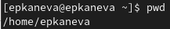
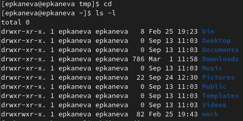
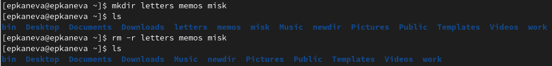
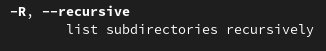
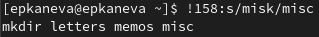

---
## Front matter
lang: ru-RU
title: Лабораторная работа №4
subtitle: Операционные системы
author:
  - Канева Е. П.
institute:
  - Российский университет дружбы народов, Москва, Россия
date: 4 марта 2023

## i18n babel
babel-lang: russian
babel-otherlangs: english

## Formatting pdf
toc: false
toc-title: Содержание
slide_level: 2
aspectratio: 169
section-titles: true
theme: metropolis
header-includes:
 - \metroset{progressbar=frametitle,sectionpage=progressbar,numbering=fraction}
 - '\makeatletter'
 - '\beamer@ignorenonframefalse'
 - '\makeatother'
---

# Информация

## Докладчик

:::::::::::::: {.columns align=center}
::: {.column width="70%"}

  * Канева Екатерина Павловна
  * Студентка группы НКАбд-02-22
  * Российский университет дружбы народов
  * <https://github.com/Nevseros/study_2022-2023_os-intro>

:::
::::::::::::::

# Вводная часть

## Цель

Приобретение практических навыков взаимодействия пользователя с системой посредством командной строки.

## Задачи

1. Определите полное имя вашего домашнего каталога. Далее относительно этого каталога будут выполняться последующие упражнения.
1. Выполните следующие действия:
 1. Перейдите в каталог `/tmp`.
 1. Выведите на экран содержимое каталога `/tmp`. Для этого используйте команду `ls` с различными опциями. Поясните разницу в выводимой на экран информации.
 1. Определите, есть ли в каталоге `/var/spool` подкаталог с именем `cron`?
 1. Перейдите в Ваш домашний каталог и выведите на экран его содержимое. Определите, кто является владельцем файлов и подкаталогов?
 
## Задачи

7. Выполните следующие действия:
 1. В домашнем каталоге создайте новый каталог с именем `newdir`.
 1. В каталоге `~/newdir` создайте новый каталог с именем `morefun`.
 1. В домашнем каталоге создайте одной командой три новых каталога с именами `letters`, `memos`, `misk`. Затем удалите эти каталоги одной командой.
 1. Попробуйте удалить ранее созданный каталог `~/newdir` командой `rm`. Проверьте, был ли каталог удалён.
 1. Удалите каталог `~/newdir/morefun` из домашнего каталога. Проверьте, был ли каталог удалён.
 
## Задачи

13. С помощью команды `man` определите, какую опцию команды `ls` нужно использовать для просмотра содержимое не только указанного каталога, но и подкаталогов, входящих в него.
1. С помощью команды `man` определите набор опций команды `ls`, позволяющий отсортировать по времени последнего изменения выводимый список содержимого каталога с развёрнутым описанием файлов.
1. Используйте команду man для просмотра описания следующих команд: `cd`, `pwd`, `mkdir`, `rmdir`, `rm`. Поясните основные опции этих команд.
1. Используя информацию, полученную при помощи команды `history`, выполните модификацию и исполнение нескольких команд из буфера команд

# Выполнение работы

## Определение пути к домашнему каталогу

Определили путь к домашнему каталогу (рис. [-@fig:001]):

{#fig:001 width=70%}

## Команда `ls`

С помощью команды `cd /tmp` перешли в каталог `tmp`. Далее вывели его содержимое с различными опциями: `-a` (рис. [-@fig:002]), `-R`, `-F`, `-l`:

{#fig:002 width=50%}

## Содержимое каталога `/var/spool`

Определили, что в каталоге `/var/spool` нет подкаталога с именем `cron` (рис. [-@fig:006]):

{#fig:006 width=70%}

## Содержимое домашнего каталога

Перешли в домашний каталог, вывели на экран его содержимое и увидели, что владельцем всех файлов является пользователь epkaneva, под которым и выполняется работа (рис. [-@fig:007]):

{#fig:007 width=50%}

## Создание и удаление каталогов

В домашнем каталоге создали одной командой три новых каталога с именами `letters`, `memos`, `misk`, затем удалили эти каталоги одной командой (рис. [-@fig:010]):

{#fig:010 width=70%}

## Команда `man`

С помощью команды `man ls` определили, что для просмотра содержимого не только указанного каталога, но и подкаталогов, входящих в него, надо использовать опцию `-R` (рис. [-@fig:011]):

{#fig:011 width=70%}

## Команда `history`

Применили команду `history` (рис. [-@fig:019]):

{#fig:019 width=70%}

## Модификация команд

Модифицировали одну из команд, тем самым создав новые директории (рис. [-@fig:020]):

{#fig:020 width=50%}

# Заключение

## Выводы

Приобрели практические навыки взаимодействия пользователя с системой посредством командной строки.
