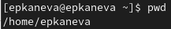
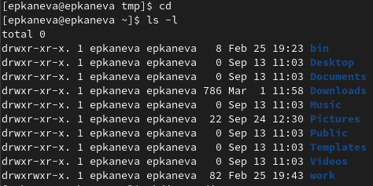
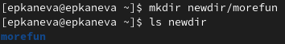
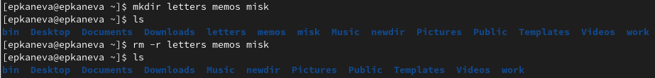
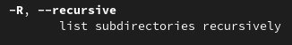
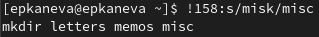
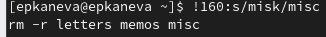

---
## Front matter
title: "Лабораторная работа №4"
subtitle: "Операционные системы"
author: "Екатерина Павловна Канева"

## Generic otions
lang: ru-RU
toc-title: "Содержание"

## Bibliography
bibliography: bib/cite.bib
csl: pandoc/csl/gost-r-7-0-5-2008-numeric.csl

## Pdf output format
toc: true # Table of contents
toc-depth: 2
lof: true # List of figures
lot: true # List of tables
fontsize: 12pt
linestretch: 1.5
papersize: a4
documentclass: scrreprt
## I18n polyglossia
polyglossia-lang:
  name: russian
  options:
	- spelling=modern
	- babelshorthands=true
polyglossia-otherlangs:
  name: english
## I18n babel
babel-lang: russian
babel-otherlangs: english
## Fonts
mainfont: PT Serif
romanfont: PT Serif
sansfont: PT Sans
monofont: PT Mono
mainfontoptions: Ligatures=TeX
romanfontoptions: Ligatures=TeX
sansfontoptions: Ligatures=TeX,Scale=MatchLowercase
monofontoptions: Scale=MatchLowercase,Scale=0.9
## Biblatex
biblatex: true
biblio-style: "gost-numeric"
biblatexoptions:
  - parentracker=true
  - backend=biber
  - hyperref=auto
  - language=auto
  - autolang=other*
  - citestyle=gost-numeric
## Pandoc-crossref LaTeX customization
figureTitle: "Рис."
tableTitle: "Таблица"
listingTitle: "Листинг"
lofTitle: "Список иллюстраций"
lotTitle: "Список таблиц"
lolTitle: "Листинги"
## Misc options
indent: true
header-includes:
  - \usepackage{indentfirst}
  - \usepackage{float} # keep figures where there are in the text
  - \floatplacement{figure}{H} # keep figures where there are in the text
---

# Цель работы

Приобретение практических навыков взаимодействия пользователя с системой посредством командной строки.

# Задание

1. Определите полное имя вашего домашнего каталога. Далее относительно этого каталога будут выполняться последующие упражнения.
1. Выполните следующие действия:
 1. Перейдите в каталог `/tmp`.
 1. Выведите на экран содержимое каталога `/tmp`. Для этого используйте команду `ls` с различными опциями. Поясните разницу в выводимой на экран информации.
 1. Определите, есть ли в каталоге `/var/spool` подкаталог с именем `cron`?
 1. Перейдите в Ваш домашний каталог и выведите на экран его содержимое. Определите, кто является владельцем файлов и подкаталогов?
1. Выполните следующие действия:
 1. В домашнем каталоге создайте новый каталог с именем `newdir`.
 1. В каталоге `~/newdir` создайте новый каталог с именем `morefun`.
 1. В домашнем каталоге создайте одной командой три новых каталога с именами `letters`, `memos`, `misk`. Затем удалите эти каталоги одной командой.
 1. Попробуйте удалить ранее созданный каталог `~/newdir` командой `rm`. Проверьте, был ли каталог удалён.
 1. Удалите каталог `~/newdir/morefun` из домашнего каталога. Проверьте, был ли каталог удалён.
1. С помощью команды `man` определите, какую опцию команды `ls` нужно использовать для просмотра содержимое не только указанного каталога, но и подкаталогов, входящих в него.
1. С помощью команды `man` определите набор опций команды `ls`, позволяющий отсортировать по времени последнего изменения выводимый список содержимого каталога с развёрнутым описанием файлов.
1. Используйте команду man для просмотра описания следующих команд: `cd`, `pwd`, `mkdir`, `rmdir`, `rm`. Поясните основные опции этих команд.
1. Используя информацию, полученную при помощи команды `history`, выполните модификацию и исполнение нескольких команд из буфера команд

# Теоретическое введение

В операционной системе типа Linux взаимодействие пользователя с системой обычно осуществляется с помощью командной строки посредством построчного ввода команд. При этом обычно используется командные интерпретаторы языка shell: `/bin/sh`; `/bin/csh`; `/bin/ks`.

**Формат команды**. Командой в операционной системе называется записанный по специальным правилам текст (возможно с аргументами), представляющий собой указание на выполнение какой-либо функций (или действий) в операционной системе. Обычно первым словом идёт имя команды, остальной текст — аргументы или опции, конкретизирующие действие.

Общий формат команд можно представить следующим образом:

```
<имя_команды><разделитель><аргументы>
```

**Команда `man`**. Команда `man` используется для просмотра (оперативная помощь) в диалоговом режиме руководства (manual) по основным командам операционной системы типа Linux.

Формат команды:

```
man <команда>
```

**Команда `cd`**. Команда `cd` используется для перемещения по файловой системе операционной системы типа Linux.

Формат команды:

```
cd [путь_к_каталогу]
```

**Команда `pwd`***. Для определения абсолютного пути к текущему каталогу используется команда pwd (print working directory).

**Команда `ls`**. Команда `ls` используется для просмотра содержимого каталога.

Формат команды:

```
ls [-опции] [путь]
```

**Команда `mkdir`**. Команда `mkdir` используется для создания каталогов.

Формат команды:

```
mkdir имя_каталога1 [имя_каталога2...]
```

**Команда `rm`**. Команда `rm` используется для удаления файлов и (или) каталогов.

Формат команды:

```
rm [-опции] [файл]
```

**Использование символа «;»**. Если требуется выполнить последовательно несколько команд, записанный в одной строке, то для этого используется символ точка с запятой.

# Выполнение лабораторной работы

* Определили путь к домашнему каталогу (рис. [-@fig:001]):

{#fig:001 width=70%}

* С помощью команды `cd /tmp` перешли в каталог `tmp`. Далее вывели его содержимое с различными опциями: `-a` (рис. [-@fig:002]), `-R` (рис. [-@fig:003]), `-F` (рис. [-@fig:004]), `-l` (рис. [-@fig:005]):

{#fig:002 width=70%}

{#fig:003 width=70%}

{#fig:004 width=70%}

{#fig:005 width=70%}

* Определили, что в каталоге `/var/spool` нет подкаталога с именем `cron` (рис. [-@fig:006]):

{#fig:006 width=70%}

* Перешли в домашний каталог, вывели на экран его содержимое и увидели, что владельцем всех файлов является пользователь epkaneva, под которым и выполняется работа (рис. [-@fig:007]):

```
cd
ls -l
```

{#fig:007 width=70%}

* В домашнем каталоге создали подкаталог с именем `newdir` (рис. [-@fig:008]):

```
mkdir newdir
```

{#fig:008 width=70%}

* В каталоге `~/newdir` создали каталог с именем `morefun` (рис. [-@fig:009]):

```
mkdir newdir/morefun
```

{#fig:009 width=70%}

* В домашнем каталоге создали одной командой три новых каталога с именами `letters`, `memos`, `misk`, затем удалили эти каталоги одной командой (рис. [-@fig:010]):

```
mkdir letters memos misk
rm -r letters memos misk
```

{#fig:010 width=70%}

* Удалили каталоги `~newdir` и `~newdir/morefun` и проверили это (рис. [-@fig:022]):

```
rm -r newdir
```

{#fig:022 width=50%}

* С помощью команды `man ls` определили, что для просмотра содержимого не только указанного каталога, но и подкаталогов, входящих в него, надо использовать опцию `-R` (рис. [-@fig:011]):

{#fig:011 width=70%}

* С помощью команды `man ls` определили набор опций команды `ls`, позволяющий отсортировать по времени последнего изменения выводимый список содержимого каталога с развёрнутым описанием файлов -- `-lt` (рис. [-@fig:012] и [-@fig:013]):

{#fig:012 width=70%}

{#fig:013 width=70%}

* Посмотрели оосновные опции команд `cd` (рис. [-@fig:014]), `pwd` (рис. [-@fig:015]), `mkdir` (рис. [-@fig:016]), `rmdir` (рис. [-@fig:017]), `rm` (рис. [-@fig:018]).

{#fig:014 width=70%}

Опция `-P` - позволяет следовать по символическим ссылкам перед тем, как будут обработаны все переходы "..", опция `-L` - переходит по символическим ссылкам только после того, как были обработаны "..".

{#fig:015 width=70%}

Опция `-L` - брать директорию из переменной окружения, даже если она содержит символические ссылки, опция `-P` - отбрасывать все символические ссылки.

{#fig:016 width=70%}

Опция `-p` (`--parents`) по надобности создаёт более высокие по иерархии директории, опция `-z` устанавливает параметры SELinux у всех созданных директорий на тип по умолчанию.

{#fig:017 width=70%}

Опция `-ignore-fail-on-non-empty` игнорирует ошибку, вызванную тем, что каталог непустой. Опция `-p` Удаляет все директории, включая те, что составляют путь.

{#fig:018 width=70%}

Опция `-f` (`--force`) позволяет игнорировать несуществующие файлы и аргументы. Опция `-i` Спрашивает подтверждение перед удалением.

* Применили команду `history` (рис. [-@fig:019]):

{#fig:019 width=70%}

 * Модифицировали одну из команд, тем самым создав новые директории (рис. [-@fig:020]):

{#fig:020 width=50%}

 * Теперь нужно удалить созданные директории, для этого модифицируем ещё одну команду (рис. [-@fig:021]). После проверки домашней директории командой `ls` убедились, что это сработало.
 
 {#fig:021 width=50%}
 
# Контрольные вопросы

1. Что такое командная строка?

Командная строка (или «консоль») – это текстовый интерфейс между человеком и компьютером, в котором инструкции компьютеру даются путём ввода с клавиатуры текстовых строк (команд). Интерфейс командной строки противопоставляется управлению программами на основе меню, а также различным реализациям графического интерфейса.

2. При помощи какой команды можно определить абсолютный путь текущего каталога? Приведите пример.

С помощью команды `pwd`. Пример см. выше (рис. [-@fig:001]).

3. При помощи какой команды и каких опций можно определить только тип файлов и их имена в текущем каталоге? Приведите примеры.

С помощью команды `ls -F`. Пример см. выше (рис. [-@fig:004]).

4. Каким образом отобразить информацию о скрытых файлах? Приведите примеры.

С помощью команды `ls -a`. Пример см. выше (рис. [-@fig:002]).

5. При помощи каких команд можно удалить файл и каталог? Можно ли это сделать одной и той же командой? Приведите примеры.

Файлы и каталоги можно удалять с помощью команды `rm` (для каталогов с опцией `-r`), пример см. выше (рис. [-@fig:011]). Каталоги можно также удалить командой `rmdir`, если они пустые.

6. Каким образом можно вывести информацию о последних выполненных пользователем командах?

С помощью команды `history`. Пример см. выше (рис. [-@fig:019]).

7. Как воспользоваться историей команд для их модифицированного выполнения? Приведите примеры.

Для этого надо использовать синтаксис:

```
!<number_of command>:s/<what_to_replace>/<replacement>
```

Пример см. выше (рис. [-@fig:020], [-@fig:021]).

8. Приведите примеры запуска нескольких команд в одной строке.

Если требуется выполнить последовательно несколько команд, записанный в одной строке, то для этого используется символ точка с запятой:

```
cd; ls
```

9. Дайте определение и приведите примера символов экранирования.

Если в заданном контексте встречаются специальные символы (типа «.», «/», «*» и т.д.), надо перед ними поставить символ экранирования \ (обратный слэш).

10. Охарактеризуйте вывод информации на экран после выполнения команды `ls` с опцией `-l`.

Выводится подробная информация (тип файла, право доступа, число ссылок, владелец, размер, дата последней ревизии, имя) по файлам и директориям, содержащимся в конкретном каталоге. 

11. Что такое относительный путь к файлу? Приведите примеры использования относительного и абсолютного пути при выполнении какой-либо команды.

Относительный путь - путь, начиная от текущего каталога; абсолютный путь - путь, начиная от корневого каталога.

Примеры:

```
cd work/study/2022-2023
cd /home/epkaneva/work
```

12. Как получить информацию об интересующей вас команде?

С помощью команды `man`. Пример см. выше (рис. [-@fig:011], [-@fig:012], [-@fig:013]).

13. Какая клавиша или комбинация клавиш служит для автоматического дополнения
вводимых команд?

Клавиша Tab.

# Выводы

Приобрели практические навыки взаимодействия пользователя с системой посредством командной строки.
