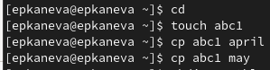
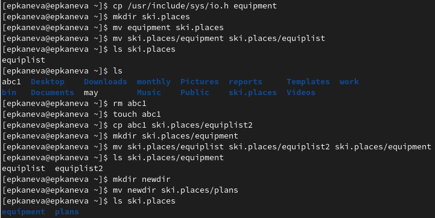

---
## Front matter
lang: ru-RU
title: Лабораторная работа №5
subtitle: Операционные системы
author:
  - Канева Е. П.
institute:
  - Российский университет дружбы народов, Москва, Россия
date: 10 марта 2023

## i18n babel
babel-lang: russian
babel-otherlangs: english

## Formatting pdf
toc: false
toc-title: Содержание
slide_level: 2
aspectratio: 169
section-titles: true
theme: metropolis
header-includes:
 - \metroset{progressbar=frametitle,sectionpage=progressbar,numbering=fraction}
 - '\makeatletter'
 - '\beamer@ignorenonframefalse'
 - '\makeatother'
---

# Информация

## Докладчик

:::::::::::::: {.columns align=center}
::: {.column width="70%"}

  * Канева Екатерина Павловна
  * Студентка группы НКАбд-02-22
  * Российский университет дружбы народов
  * <https://github.com/Nevseros/study_2022-2023_os-intro>

:::
::::::::::::::

# Вводная часть

## Цель

Ознакомление с файловой системой Linux, её структурой, именами и содержанием каталогов. Приобретение практических навыков по применению команд для работы с файлами и каталогами, по управлению процессами (и работами), по проверке использования диска и обслуживанию файловой системы.

## Задачи

* Выполнить команды из примеров, приведённых в тексте лабораторной работы.
* Выполнить команды для создания, перемещения и копирования файлов и каталогов.
* Выполнить команды для изменения прав доступа к файлам и каталогам.

# Выполнение лабораторной работы

## Выполнение примеров

Выполнили все примеры, приведённые в первой части описания лабораторной работы (например, рис. [-@fig:01]):

{#fig:01 width=70%}

## Работа с созданием, перемещением и копированием файлов и каталогов

Выполнили команды, создающие, копирующие и перемещающие файлы и каталоги, согласно заданию лабораторной работы (рис. [-@fig:16]):

{#fig:16 width=70%}

## Изменение прав доступа к файлам и каталогам

Определили опции команды `chmod`, необходимые для того, чтобы присвоить файлам выделенные права доступа, считая, что в начале таких прав нет (например, рис. [-@fig:15]):

{#fig:15 width=70%}

## Некоторые другие команды

Скопировали каталог `~/play` в каталог `~/fun`. Переместили каталог `~/fun` в каталог `~/play` и назвали его `games` (рис. [-@fig:23]):

{#fig:23 width=70%}

## Некоторые другие команды

Лишили владельца файла `~/feathers` права на чтение (рис. [-@fig:24]):

{#fig:24 width=70%}

## Некоторые другие команды

Теперь содержимое файла `~/feathers` невозможно посмотреть командой `cat` (рис. [-@fig:25]):

{#fig:25 width=50%}

## Команды `mount`, `fsck`, `mkfs`, `kill`

Прочитали `man` по командам `mount` (рис. [-@fig:31]), `fsck`, `mkfs`, `kill`:

{#fig:31 width=70%}

# Заключение

## Выводы

Ознакомились с файловой системой Linux, её структурой, именами и содержанием каталогов. Приобрели практические навыки по применению команд для работы с файлами и каталогами, по управлению процессами (и работами), по проверке использования диска и обслуживанию файловой системы.
