---
## Front matter
title: "Отчёт по лабораторной работе №5"
subtitle: "Операционные системы"
author: "Екатерина Павловна Канева"

## Generic otions
lang: ru-RU
toc-title: "Содержание"

## Bibliography
bibliography: bib/cite.bib
csl: pandoc/csl/gost-r-7-0-5-2008-numeric.csl

## Pdf output format
toc: true # Table of contents
toc-depth: 2
lof: true # List of figures
lot: true # List of tables
fontsize: 12pt
linestretch: 1.5
papersize: a4
documentclass: scrreprt
## I18n polyglossia
polyglossia-lang:
  name: russian
  options:
	- spelling=modern
	- babelshorthands=true
polyglossia-otherlangs:
  name: english
## I18n babel
babel-lang: russian
babel-otherlangs: english
## Fonts
mainfont: PT Serif
romanfont: PT Serif
sansfont: PT Sans
monofont: PT Mono
mainfontoptions: Ligatures=TeX
romanfontoptions: Ligatures=TeX
sansfontoptions: Ligatures=TeX,Scale=MatchLowercase
monofontoptions: Scale=MatchLowercase,Scale=0.9
## Biblatex
biblatex: true
biblio-style: "gost-numeric"
biblatexoptions:
  - parentracker=true
  - backend=biber
  - hyperref=auto
  - language=auto
  - autolang=other*
  - citestyle=gost-numeric
## Pandoc-crossref LaTeX customization
figureTitle: "Рис."
tableTitle: "Таблица"
listingTitle: "Листинг"
lofTitle: "Список иллюстраций"
lotTitle: "Список таблиц"
lolTitle: "Листинги"
## Misc options
indent: true
header-includes:
  - \usepackage{indentfirst}
  - \usepackage{float} # keep figures where there are in the text
  - \floatplacement{figure}{H} # keep figures where there are in the text
---

# Цель работы

Ознакомление с файловой системой Linux, её структурой, именами и содержанием каталогов. Приобретение практических навыков по применению команд для работы с файлами и каталогами, по управлению процессами (и работами), по проверке использования диска и обслуживанию файловой системы.

# Задание

* Выполните все примеры, приведённые в первой части описания лабораторной работы.
* Выполните следующие действия, зафиксировав в отчёте по лабораторной работе используемые при этом команды и результаты их выполнения:

1. Скопируйте файл `/usr/include/sys/io.h` в домашний каталог и назовите его `equipment`. Если файла `io.h` нет, то используйте любой другой файл в каталоге `/usr/include/sys/` вместо него.
2. В домашнем каталоге создайте директорию `~/ski.plases`.
3. Переместите файл equipment в каталог `~/ski.plases`.
4. Переименуйте файл `~/ski.plases/equipment` в `~/ski.plases/equiplist`.
5. Создайте в домашнем каталоге файл `abc1` и скопируйте его в каталог `~/ski.plases`, назовите его `equiplist2`.
6. Создайте каталог с именем `equipment` в каталоге `~/ski.plases`.
7. Переместите файлы `~/ski.plases/equiplist` и `equiplist2` в каталог `~/ski.plases/equipment`.
8. Создайте и переместите каталог `~/newdir` в каталог `~/ski.plases` и назовите его `plans`.

* Определите опции команды `chmod`, необходимые для того, чтобы присвоить перечисленным ниже файлам выделенные права доступа, считая, что в начале таких прав нет:

1. `drwxr--r-- ... australia`
2. `drwx--x--x ... play`
3. `-r-xr--r-- ... my_os`
4. `-rw-rw-r-- ... feathers`

* Проделайте приведённые ниже упражнения, записывая в отчёт по лабораторной работе используемые при этом команды:

1. Просмотрите содержимое файла `/etc/password`.
2. Скопируйте файл `~/feathers` в файл `~/file.old`.
3. Переместите файл `~/file.old` в каталог `~/play`.
4. Скопируйте каталог `~/play` в каталог `~/fun`.
5. Переместите каталог `~/fun` в каталог `~/play` и назовите его `games`.
6. Лишите владельца файла `~/feathers` права на чтение.
7. Что произойдёт, если вы попытаетесь просмотреть файл `~/feathers` командой `cat`?
8. Что произойдёт, если вы попытаетесь скопировать файл `~/feathers`?
9. Дайте владельцу файла `~/feathers` право на чтение.
10. Лишите владельца каталога `~/play` права на выполнение.
11. Перейдите в каталог `~/play`. Что произошло?
12. Дайте владельцу каталога `~/play` право на выполнение.

* Прочитайте man по командам `mount`, `fsck`, `mkfs`, `kill` и кратко их охарактеризуйте, приведя примеры.

# Теоретическое введение

Файловая система (ФС) — архитектура хранения данных, которые могут находиться в разделах жесткого диска и ОП. Выдает пользователю доступ к конфигурации ядра. Определяет, какую структуру принимают файлы в каждом из разделов, создает правила для их генерации, а также управляет файлами в соответствии с особенностями каждой конкретной ФС.

Основные файловые системы, используемые в дистрибутивах Linux: Ext2; Ext3; Ext4; JFS; ReiserFS; XFS; Btrfs; ZFS. Ext2, Ext3, Ext4 или Extended Filesystem – стандартная файловая система, первоначально разработанная еще для Minix.

# Выполнение лабораторной работы

* Выполнили команды из примеров, приведёных в тексте лабораторной работы (рис. [-@fig:01], [-@fig:02], [-@fig:03], [-@fig:04], [-@fig:05], [-@fig:06], [-@fig:07], [-@fig:08], [-@fig:09], [-@fig:10], [-@fig:11], [-@fig:12], [-@fig:13], [-@fig:14]):

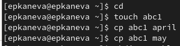{#fig:01 width=70%}

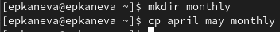{#fig:02 width=70%}

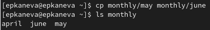{#fig:03 width=70%}

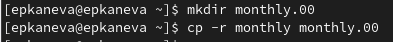{#fig:04 width=70%}

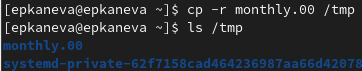{#fig:05 width=70%}

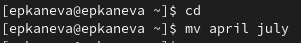{#fig:06 width=70%}

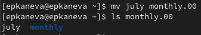{#fig:07 width=70%}

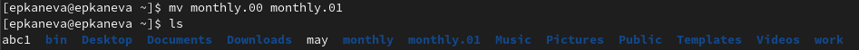{#fig:08 width=70%}

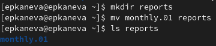{#fig:09 width=70%}

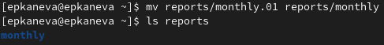{#fig:10 width=70%}

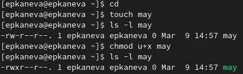{#fig:11 width=70%}

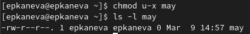{#fig:12 width=70%}

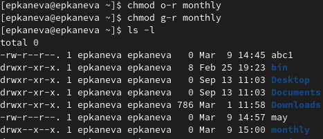{#fig:13 width=70%}

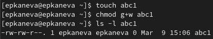{#fig:14 width=70%}

* Выполнили следующие действия (рис. [-@fig:16]):

1. Скопировали файл `/usr/include/sys/io.h` в домашний каталог и назвали его `equipment`. 
2. В домашнем каталоге создали директорию `~/ski.plases`.
3. Переместили файл equipment в каталог `~/ski.plases`.
4. Переименовали файл `~/ski.plases/equipment` в `~/ski.plases/equiplist`.
5. Создали в домашнем каталоге файл `abc1` и скопировали его в каталог `~/ski.plases`, назвали его `equiplist2`.
6. Создали каталог с именем `equipment` в каталоге `~/ski.plases`.
7. Переместили файлы `~/ski.plases/equiplist` и `equiplist2` в каталог `~/ski.plases/equipment`.
8. Создали и переместили каталог `~/newdir` в каталог `~/ski.plases` и назвали его `plans`. 

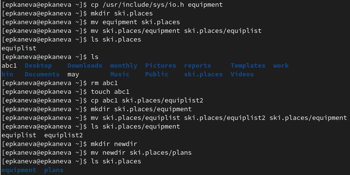{#fig:16 width=70%}

* Определили опции команды `chmod`, необходимые для того, чтобы присвоить перечисленным ниже файлам выделенные права доступа, считая, что в начале таких прав нет:

1. `drwxr--r-- ... australia` (рис. [-@fig:15]):

```
mkdir australia
chmod u+r+w+x australia
chmod g+r-w-x australia
chmod o+r-w-x australia
```

{#fig:15 width=70%}

2. `drwx--x--x ... play` (рис. [-@fig:17]):

```
mkdir play
chmod u+r+w+x play
chmod g-r-w+x play
chmod o-r-w+x play
```

{#fig:17 width=70%}

3. `-r-xr--r-- ... my_os` (рис. [-@fig:18]):

```
touch my_os
chmod u+r-w+x my_os
chmod g+r-w-x my_os
chmod o+r-w-x my_os
```

{#fig:18 width=70%}

4. `-rw-rw-r-- ... feathers` (рис. [-@fig:19]):

```
touch feathers
chmod u+r+w-x feathers
chmod g+r+w-x feathers
chmod o+r-w-x feathers
```

{#fig:19 width=70%}

* Проделали приведённые ниже упражнения:

1. Просмотрели содержимое файла `/etc/passwd` (рис. [-@fig:20]):

{#fig:20 width=70%}

2. Скопировали файл `~/feathers` в файл `~/file.old` (рис. [-@fig:21]):

{#fig:21 width=70%}

3. Переместили файл `~/file.old` в каталог `~/play` (рис. [-@fig:22]):

{#fig:22 width=70%}

4. Скопировали каталог `~/play` в каталог `~/fun`. Переместили каталог `~/fun` в каталог `~/play` и назвали его `games` (рис. [-@fig:23]):

{#fig:23 width=70%}

5. Лишили владельца файла `~/feathers` права на чтение (рис. [-@fig:24]). Теперь его содержимое невозможно посмотреть командой `cat` (рис. [-@fig:25]) или скопировать (рис. [-@fig:26]) из текущего пользователя:

{#fig:24 width=70%}

{#fig:25 width=50%}

{#fig:26 width=50%}

6. Дали владельцу файла `~/feathers` право на чтение (рис. [-@fig:27]):

{#fig:27 width=70%}

7. Лишили владельца каталога `~/play` права на выполнение (рис. [-@fig:28]). Теперь в этот каталог невозможно перейти (рис. [-@fig:29]):

{#fig:28 width=70%}

{#fig:29 width=50%}

8. Дали владельцу каталога `~/play` право на выполнение (рис. [-@fig:30]):

{#fig:30 width=70%}

* Прочитали `man` по командам `mount` (рис. [-@fig:31]), `fsck` (рис. [-@fig:32]), `mkfs` (рис. [-@fig:33]), `kill` (рис. [-@fig:34]):

{#fig:31 width=70%}

Команда `mount` используется для просмотра используемых в операционной системе файловых систем.

{#fig:32 width=70%}

С помощью команды `fsck` можно проверить (а в ряде случаев восстановить) целостность файловой системы.

{#fig:33 width=70%}

Команда `mkfs` используется для создания файловой системы Linux на некотором устройстве.

{#fig:34 width=70%}

Команда `kill` передаёт сигнал для прекращения процесса.

# Контрольные вопросы

1. Дайте характеристику каждой файловой системе, существующей на жёстком диске компьютера, на котором вы выполняли лабораторную работу.

Ext2, Ext3, Ext4 или Extended Filesystem - это стандартная файловая система для Linux. Она была разработана еще для Minix. Она самая стабильная из всех существующих, кодовая база изменяется очень редко и эта файловая система содержит больше всего функций. Версия ext2 была разработана уже именно для Linux и получила много улучшений. В 2001 году вышла ext3, которая добавила еще больше стабильности благодаря использованию журналирования. В 2006 была выпущена версия ext4, которая используется во всех дистрибутивах Linux до сегодняшнего дня. В ней было внесено много улучшений, в том числе увеличен максимальный размер раздела до одного экзабайта.

Btrfs или B-Tree File System - это совершенно новая файловая система, которая сосредоточена на отказоустойчивости, легкости администрирования и восстановления данных. Файловая система объединяет в себе очень много новых интересных возможностей, таких как размещение на нескольких разделах, поддержка подтомов, изменение размера не лету, создание мгновенных снимков, а также высокая производительность. Но многими пользователями файловая система Btrfs считается нестабильной. Тем не менее, она уже используется как файловая система по умолчанию в OpenSUSE и SUSE Linux.

2. Приведите общую структуру файловой системы и дайте характеристику каждой директории первого уровня этой структуры.

* `/` — корневой каталог. Содержит в себе всю иерархию системы.

* `/bin` — здесь находятся двоичные исполняемые файлы. Основные общие команды, хранящиеся отдельно от других программ в системе.

* `/boot` — тут расположены файлы, используемые для загрузки системы.

* `/dev` — в данной директории располагаются файлы устройств (драйверов). С помощью этих файлов можно взаимодействовать с устройствами.

* `/etc` — в этой директории находятся файлы конфигураций программ. Эти файлы позволяют настраивать системы, сервисы.

* `/home` — каталог, аналогичный каталогу `Users` в Windows. Содержит домашние каталоги учетных записей пользователей (кроме root).

* `/lib` — содержит системные библиотеки, с которыми работают программы и модули ядра.

* `/lost+found` — содержит файлы, восстановленные после сбоя работы системы.

* `/media` — точка монтирования внешних носителей.

* `/mnt` — точка временного монтирования. 

* `/opt` — тут расположены дополнительные (необязательные) приложения.

* `/proc` — содержит файлы, хранящие информацию о запущенных процессах и о состоянии ядра ОС.

* `/root` — директория, которая содержит файлы и личные настройки суперпользователя.

* `/run` — содержит файлы состояния приложений.

* `/srv` — содержит файлы сервисов, предоставляемых сервером.

* `/sys` — содержит данные непосредственно о системе.

* `/tmp` — содержит временные файлы. 

* `/usr` — содержит пользовательские приложения и утилиты второго уровня, используемые пользователями, а не системой.

* `/var` — содержит переменные файлы.

3. Какая операция должна быть выполнена, чтобы содержимое некоторой файловой системы было доступно операционной системе?

Монтирование тома.

4. Назовите основные причины нарушения целостности файловой системы. Как устранить повреждения файловой системы?

Отсутствие синхронизации между образом файловой системы в памяти и ее данными на диске в случае аварийного останова может привести к появлению следующих ошибок:

* Один блок адресуется несколькими mode (принадлежит нескольким файлам).
* Блок помечен как свободный, но в то же время занят (на него ссылается onode).
* Блок помечен как занятый, но в то же время свободен (ни один inode на него не ссылается).
* Неправильное число ссылок в inode (недостаток или избыток ссылающихся записей в каталогах).
* Несовпадение между размером файла и суммарным размером адресуемых inode блоков.
* Недопустимые адресуемые блоки (например, расположенные за пределами файловой системы).
* "Потерянные" файлы (правильные inode, на которые не ссылаются записи каталогов).
* Недопустимые или неразмещенные номера inode в записях каталогов.

5. Как создаётся файловая система?

`mkfs` позволяет создать файловую систему Linux.

6. Дайте характеристику командам для просмотра текстовых файлов.

`cat` выводит содержимое файла на стандартное устройство вывода

7. Приведите основные возможности команды `cp` в Linux.

`cp` копирует или перемещает директорию, файлы.

8. Приведите основные возможности команды `mv` в Linux.

`mv` - переименовать или переместить файл или директорию

9. Что такое права доступа? Как они могут быть изменены?

Права доступа к файлу или каталогу можно изменить, воспользовавшись командой `chmod`. Сделать это может владелец файла (или каталога) или пользователь с правами администратора.

# Выводы

Ознакомились с файловой системой Linux, её структурой, именами и содержанием каталогов. Приобрели практические навыки по применению команд для работы с файлами и каталогами, по управлению процессами (и работами), по проверке использования диска и обслуживанию файловой системы.
