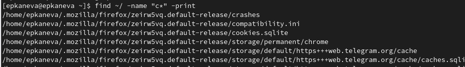
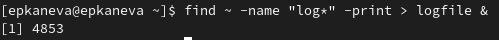

---
## Front matter
lang: ru-RU
title: Лабораторная работа №6
subtitle: Операционные системы
author:
  - Канева Е. П.
institute:
  - Российский университет дружбы народов, Москва, Россия
date: 18 марта 2023

## i18n babel
babel-lang: russian
babel-otherlangs: english

## Formatting pdf
toc: false
toc-title: Содержание
slide_level: 2
aspectratio: 169
section-titles: true
theme: metropolis
header-includes:
 - \metroset{progressbar=frametitle,sectionpage=progressbar,numbering=fraction}
 - '\makeatletter'
 - '\beamer@ignorenonframefalse'
 - '\makeatother'
---

# Информация

## Докладчик

:::::::::::::: {.columns align=center}
::: {.column width="70%"}

  * Канева Екатерина Павловна
  * Студентка группы НКАбд-02-22
  * Российский университет дружбы народов
  * <https://github.com/Nevseros/study_2022-2023_os-intro>

:::
::::::::::::::

# Вводная часть

## Цель

Ознакомление с инструментами поиска файлов и фильтрации текстовых данных. Приобретение практических навыков: по управлению процессами (и заданиями), по проверке использования диска и обслуживанию файловых систем.

## Задачи

1. Запишите в файл `file.txt` названия файлов, содержащихся в каталоге `/etc`. Допишите в этот же файл названия файлов, содержащихся в вашем домашнем каталоге.
2. Выведите имена всех файлов из `file.txt`, имеющих расширение `.conf`, после чего запишите их в новый текстовой файл `conf.txt`.
3. Определите, какие файлы в вашем домашнем каталоге имеют имена, начинавшиеся с символа `c`? Предложите несколько вариантов, как это сделать.
4. Выведите на экран имена файлов из каталога `/etc`, начинающиеся с символа `h`.
5. Запустите в фоновом режиме процесс, который будет записывать в файл `~/logfile` файлы, имена которых начинаются с `log`.
6. Удалите файл `~/logfile`.
7. Запустите из консоли в фоновом режиме редактор `gedit`.
8. Определите идентификатор процесса `gedit`, используя команду `ps`, конвейер и фильтр `grep`. Как ещё можно определить идентификатор процесса?
9. Прочтите справку (`man`) команды `kill`, после чего используйте её для завершения процесса `gedit`.
10. Выполните команды `df` и `du`, предварительно получив более подробную информацию об этих командах, с помощью команды man.
11. Воспользовавшись справкой команды `find`, выведите имена всех директорий, имеющихся в вашем домашнем каталоге.

# Выполнение работы

## Запись и дозапись в файл

Записали в файл `file.txt` названия файлов, содержащихся в каталоге `/etc`, дописали в этот же файл названия файлов, содержащихся в вашем домашнем каталоге (рис. [-@fig:01]):

{#fig:01 width=50%}

## Вывод и запись имён файлов

Вывели имена всех файлов из `file.txt`, имеющих расширение `.conf`, после чего записали их в новый текстовый файл `conf.txt` (рис. [-@fig:03]):

{#fig:03 width=70%}

## Файлы с нужным именем

Определили, какие файлы в домашнем каталоге имеют имена, начинавшиеся с символа `c` (рис. [-@fig:04]):

{#fig:04 width=70%}

## Файлы с нужным именем

Вывели на экран имена файлов из каталога `/etc`, начинающиеся с символа `h` (рис. [-@fig:06]):

{#fig:06 width=70%}

## Процессы в фоновом режиме

Запустили в фоновом режиме процесс, который будет записывать в файл `~/logfile` файлы, имена которых начинаются с `log` (рис. [-@fig:07]):

{#fig:07 width=70%}

## Процессы в фоновом режиме

Запустили из консоли в фоновом режиме редактор `gedit`, определили идентификатор процесса `gedit`, используя команду `ps`, конвейер и фильтр `grep`(рис. [-@fig:09]). Идентификатор также указывался сразу после запуска команды:

{#fig:09 width=70%}

## Команда `kill`

Использовали команду `kill`, чтобы завершить процесс `gedit` (рис. [-@fig:11]):

{#fig:10 width=70%}

## Команды `df` и `du`

Получив подробную информацию о командах `df` и `du`, выполнили их (рис. [-@fig:14] и [-@fig:15]).

## Команда `df`

{#fig:14 width=70%}

## Команда `du`

{#fig:15 width=70%}

## Команда `find`

Вывели имена всех директорий, имеющихся в домашнем каталоге (рис. [-@fig:17]):

{#fig:17 width=50%}

# Заключение

## Выводы

Ознакомились с инструментами поиска файлов и фильтрации текстовых данных. Приобрели практические навыки: по управлению процессами (и заданиями), по проверке использования диска и обслуживанию файловых систем.
