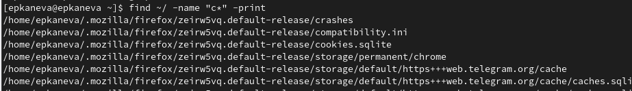
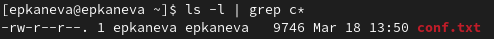
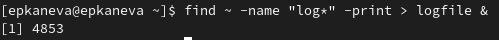
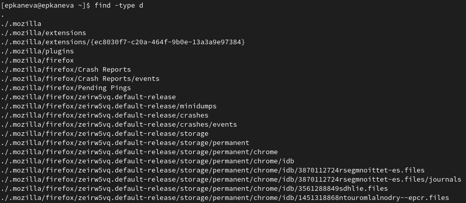

---
## Front matter
title: "Отчёт по лабораторной работе №6"
subtitle: "Операционные системы"
author: "Екатерина Павловна Канева"

## Generic otions
lang: ru-RU
toc-title: "Содержание"

## Bibliography
bibliography: bib/cite.bib
csl: pandoc/csl/gost-r-7-0-5-2008-numeric.csl

## Pdf output format
toc: true # Table of contents
toc-depth: 2
lof: true # List of figures
lot: true # List of tables
fontsize: 12pt
linestretch: 1.5
papersize: a4
documentclass: scrreprt
## I18n polyglossia
polyglossia-lang:
  name: russian
  options:
	- spelling=modern
	- babelshorthands=true
polyglossia-otherlangs:
  name: english
## I18n babel
babel-lang: russian
babel-otherlangs: english
## Fonts
mainfont: PT Serif
romanfont: PT Serif
sansfont: PT Sans
monofont: PT Mono
mainfontoptions: Ligatures=TeX
romanfontoptions: Ligatures=TeX
sansfontoptions: Ligatures=TeX,Scale=MatchLowercase
monofontoptions: Scale=MatchLowercase,Scale=0.9
## Biblatex
biblatex: true
biblio-style: "gost-numeric"
biblatexoptions:
  - parentracker=true
  - backend=biber
  - hyperref=auto
  - language=auto
  - autolang=other*
  - citestyle=gost-numeric
## Pandoc-crossref LaTeX customization
figureTitle: "Рис."
tableTitle: "Таблица"
listingTitle: "Листинг"
lofTitle: "Список иллюстраций"
lotTitle: "Список таблиц"
lolTitle: "Листинги"
## Misc options
indent: true
header-includes:
  - \usepackage{indentfirst}
  - \usepackage{float} # keep figures where there are in the text
  - \floatplacement{figure}{H} # keep figures where there are in the text
---

# Цель работы

Ознакомление с инструментами поиска файлов и фильтрации текстовых данных. Приобретение практических навыков: по управлению процессами (и заданиями), по проверке использования диска и обслуживанию файловых систем.

# Задание

1. Запишите в файл `file.txt` названия файлов, содержащихся в каталоге `/etc`. Допишите в этот же файл названия файлов, содержащихся в вашем домашнем каталоге.
2. Выведите имена всех файлов из `file.txt`, имеющих расширение `.conf`, после чего запишите их в новый текстовой файл `conf.txt`.
3. Определите, какие файлы в вашем домашнем каталоге имеют имена, начинавшиеся с символа `c`? Предложите несколько вариантов, как это сделать.
4. Выведите на экран имена файлов из каталога `/etc`, начинающиеся с символа `h`.
5. Запустите в фоновом режиме процесс, который будет записывать в файл `~/logfile` файлы, имена которых начинаются с `log`.
6. Удалите файл `~/logfile`.
7. Запустите из консоли в фоновом режиме редактор `gedit`.
8. Определите идентификатор процесса `gedit`, используя команду `ps`, конвейер и фильтр `grep`. Как ещё можно определить идентификатор процесса?
9. Прочтите справку (`man`) команды `kill`, после чего используйте её для завершения процесса `gedit`.
10. Выполните команды `df` и `du`, предварительно получив более подробную информацию об этих командах, с помощью команды man.
11. Воспользовавшись справкой команды `find`, выведите имена всех директорий, имеющихся в вашем домашнем каталоге.

# Теоретическое введение

В интерфейсе командной строки есть очень полезная возможность перенаправления (переадресации) ввода и вывода (англ. термин I/O Redirection). Как мы уже заметили, многие программы выводят данные на экран. А ввод данных в терминале осуществляется с клавиатуры. С помощью специальных обозначений можно перенаправить вывод многих команд в файлы или иные устройства вывода (например, распечатать на принтере). Тоже самое и со вводом информации, вместо ввода данных с клавиатуры, для многих программ можно задать считывание символов их файла. Кроме того, можно даже вывод одной программы передать на ввод другой программе.

К каждой программе, запускаемой в командной строке, по умолчанию подключено три потока данных: 

STDIN (0) — стандартный поток ввода (данные, загружаемые в программу).
STDOUT (1) — стандартный поток вывода (данные, которые выводит программа). По умолчанию — терминал.
STDERR (2) — стандартный поток вывода диагностических и отладочных сообщений (например, сообщениях об ошибках). По умолчанию — терминал.

Pipe (конвеер) – это однонаправленный канал межпроцессного взаимодействия. Термин был придуман Дугласом Макилроем для командной оболочки Unix и назван по аналогии с трубопроводом. Конвейеры чаще всего используются в shell-скриптах для связи нескольких команд путем перенаправления вывода одной команды (stdout) на вход (stdin) последующей, используя символ конвеера ‘|’.

# Выполнение лабораторной работы

* Записали в файл `file.txt` названия файлов, содержащихся в каталоге `/etc`, дописали в этот же файл названия файлов, содержащихся в вашем домашнем каталоге (рис. [-@fig:01]):

{#fig:01 width=70%}

* Вывели имена всех файлов из `file.txt`, имеющих расширение `.conf`, после чего записали их в новый текстовый файл `conf.txt` (рис. [-@fig:02] и [-@fig:03]):

{#fig:02 width=70%}

{#fig:03 width=70%}

* Определили, какие файлы в домашнем каталоге имеют имена, начинавшиеся с символа `c` (рис. [-@fig:04] и [-@fig:05]):

{#fig:04 width=70%}

{#fig:05 width=70%}

* Вывели на экран имена файлов из каталога `/etc`, начинающиеся с символа `h` (рис. [-@fig:06]):

{#fig:06 width=70%}

* Запустили в фоновом режиме процесс, который будет записывать в файл `~/logfile` файлы, имена которых начинаются с `log` (рис. [-@fig:07]). Как видим, идентификатор процесса - `4853`.

{#fig:07 width=70%}

* Удалили файл `~/logfile` (рис. [-@fig:08]):

{#fig:08 width=70%}

* Запустили из консоли в фоновом режиме редактор `gedit`, определили идентификатор процесса `gedit`, используя команду `ps`, конвейер и фильтр `grep`(рис. [-@fig:09]). Идентификатор также указывался сразу после запуска команды:

{#fig:09 width=70%}

* Прочитали справку (`man`) команды `kill` (рис. [-@fig:10]), после чего использовали её для завершения процесса `gedit` (рис. [-@fig:11]):

{#fig:10 width=70%}

{#fig:11 width=70%}

* Получив подробную информацию о командах `df` (рис. [-@fig:12]) и `du` (рис. [-@fig:13]), выполнили их (рис. [-@fig:14] и [-@fig:15]):

{#fig:12 width=70%}

{#fig:13 width=70%}

{#fig:14 width=70%}

{#fig:15 width=70%}

* Воспользовавшись справкой команды `find` (рис. [-@fig:16]), вывели имена всех директорий, имеющихся в домашнем каталоге (рис. [-@fig:17]):

{#fig:16 width=70%}

{#fig:17 width=70%}

# Контрольные вопросы

1. Какие потоки ввода вывода вы знаете?
 
* stdin — стандартный поток ввода (по умолчанию: клавиатура), файловый дескриптор 0
* stdout — стандартный поток вывода (по умолчанию: консоль), файловый дескриптор 1
* stderr — стандартный поток вывод сообщений об ошибках (по умолчанию: консоль), файловый дескриптор 2

2. Объясните разницу между операцией `>` и `>>`.

Этот знак `>` - перенаправление ввода/вывода, а `>>` - перенаправление в режиме добавления.
 
3. Что такое конвейер?

Конвейер (`pipe`) служит для объединения простых команд или утилит в цепочки, в которых результат работы предыдущей команды передаётся последующей. 

4. Что такое процесс? Чем это понятие отличается от программы?

Главное отличие между программой и процессом заключается в том, что программа - это набор инструкций, который позволяет ЦПУ выполнять определенную задачу, в то время как процесс - это исполняемая программа. 

5. Что такое PID и GID?

PPID - (parent process ID) идентификатор родительского процесса. Процесс может порождать и другие процессы. UID, GID - реальные идентификаторы пользователя и его группы, запустившего данный процесс. 

6. Что такое задачи и какая команда позволяет ими управлять?

Запущенные фоном программы называются задачами (jobs). Ими можно управлять с помощью команды `jobs`, которая выводит список запущенных в данный момент задач.

7. Найдите информацию об утилитах `top` и `htop`. Каковы их функции?

Команда `htop` похожа на команду `top` по выполняемой функции: они обе показывают информацию о процессах в реальном времени, выводят данные о потреблении системных ресурсов и позволяют искать, останавливать и управлять процессами.

У обеих команд есть свои преимущества. Например, в программе `htop` реализован очень удобный поиск по процессам, а также их фильтрация. В команде `top` это не так удобно — нужно знать кнопку для вывода функции поиска.

Зато в `top` можно разделять область окна и выводить информацию о процессах в соответствии с разными настройками. В целом `top` намного более гибкая в настройке отображения процессов.

8. Назовите и дайте характеристику команде поиска файлов. Приведите примеры использования этой команды.

Команда `find` - это одна из наиболее важных и часто используемых утилит системы Linux. Это команда для поиска файлов и каталогов на основе специальных условий. Ее можно использовать в различных обстоятельствах, например, для поиска файлов по разрешениям, владельцам, группам, типу, размеру и другим подобным критериям.

Утилита `find` предустановлена по умолчанию во всех Linux дистрибутивах, поэтому вам не нужно будет устанавливать никаких дополнительных пакетов. Это очень важная находка для тех, кто хочет использовать командную строку наиболее эффективно.

Команда find имеет такой синтаксис:

```
find [папка] [параметры] критерий шаблон [действие]
```

Пример: см. рис. [-@fig:17].

9. Можно ли по контексту (содержанию) найти файл? Если да, то как?

```
find / -type f -exec grep -H 'text_here' {} \
```

10. Как определить объем свободной памяти на жёстком диске?

С помощью команды `df -h`. 

11. Как определить объем вашего домашнего каталога?

С помощью команды `du -s`. 

12. Как удалить зависший процесс?

С помощью команды `kill` номер задачи.

# Выводы

Ознакомились с инструментами поиска файлов и фильтрации текстовых данных. Приобрели практические навыки: по управлению процессами (и заданиями), по проверке использования диска и обслуживанию файловых систем.
