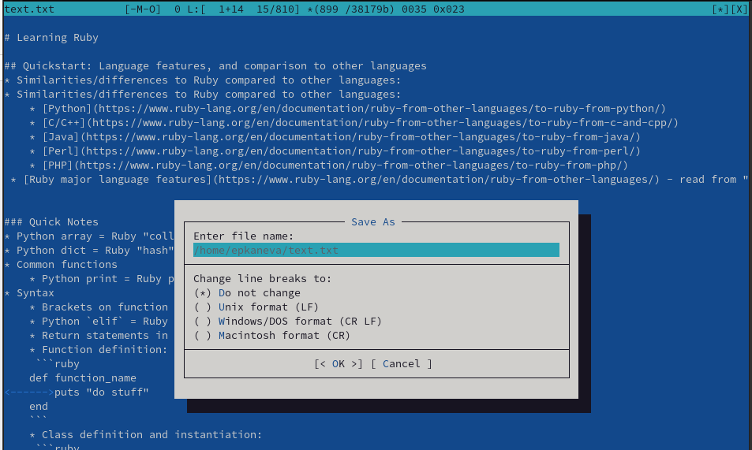

---
## Front matter
lang: ru-RU
title: Лабораторная работа №7
subtitle: Операционные системы
author:
  - Канева Е. П.
institute:
  - Российский университет дружбы народов, Москва, Россия
date: 25 марта 2023

## i18n babel
babel-lang: russian
babel-otherlangs: english

## Formatting pdf
toc: false
toc-title: Содержание
slide_level: 2
aspectratio: 169
section-titles: true
theme: metropolis
header-includes:
 - \metroset{progressbar=frametitle,sectionpage=progressbar,numbering=fraction}
 - '\makeatletter'
 - '\beamer@ignorenonframefalse'
 - '\makeatother'
---

# Информация

## Докладчик

:::::::::::::: {.columns align=center}
::: {.column width="70%"}

  * Канева Екатерина Павловна
  * Студентка группы НКАбд-02-22
  * Российский университет дружбы народов
  * <https://github.com/Nevseros/study_2022-2023_os-intro>

:::
::::::::::::::

# Вводная часть

## Цель

Освоение основных возможностей командной оболочки Midnight Commander. Приобретение навыков практической работы по просмотру каталогов и файлов, манипуляций с ними.

## Задания

- Выполнить задания по mc
- Выполнить задания по mcedit

# Выполнение работы

# Задания по mc

## Просмотр информации о файле

* Выполнили несколько операций, например, просмотр информации о файле (рис. [-@fig:03]):

{#fig:03 width=50%}

## Просмотр содержимого текстового файла

* Выполнили просмотр содержимого текстового файла (рис. [-@fig:05]):

{#fig:05 width=50%}

## Создание каталога

* Выполнили создание каталога (рис. [-@fig:08]):

{#fig:08 width=50%}

## Поиск в файловой системе

* Выполнили поиск в файловой системе файла с заданными условиями (рис. [-@fig:10]):

{#fig:10 width=50%}

# Задания по mcedit

## Создание файла и редактирование

* Создали текстовый файл `text.txt`, открыли этот файл с помощью встроенного в mc редактора, вставили в открытый файл небольшой фрагмент текста, скопированный из Интернета (рис. [-@fig:17]):

{#fig:17 width=50%}

## Действия с файлом

* Удалили строку текста, выделили фрагмент текста и скопировали его на новую строку, выделили фрагмент текста и перенесли его на новую строку, сохранили файл (рис. [-@fig:18]):

{#fig:18 width=50%}

## Файлы на языках программирования

* Открыли файл с исходным текстом на C++ (рис. [-@fig:22]):

{#fig:22 width=50%}

## Файлы на языках программирования

* Используя меню редактора, выключили подсветку синтаксиса (рис. [-@fig:23]):

{#fig:23 width=50%}

# Выводы

Освоили основные возможностей командной оболочки Midnight Commander. Приобрели навыки практической работы по просмотру каталогов и файлов, манипуляций с ними.
