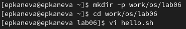
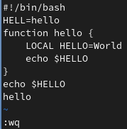
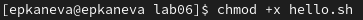
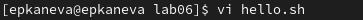
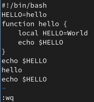

---
## Front matter
lang: ru-RU
title: Лабораторная работа №8
subtitle: Операционные системы
author:
  - Канева Е. П.
institute:
  - Российский университет дружбы народов, Москва, Россия
date: 30 марта 2023

## i18n babel
babel-lang: russian
babel-otherlangs: english

## Formatting pdf
toc: false
toc-title: Содержание
slide_level: 2
aspectratio: 169
section-titles: true
theme: metropolis
header-includes:
 - \metroset{progressbar=frametitle,sectionpage=progressbar,numbering=fraction}
 - '\makeatletter'
 - '\beamer@ignorenonframefalse'
 - '\makeatother'
---

# Информация

## Докладчик

:::::::::::::: {.columns align=center}
::: {.column width="70%"}

  * Канева Екатерина Павловна
  * Студентка группы НКАбд-02-22
  * Российский университет дружбы народов
  * <https://github.com/Nevseros/study_2022-2023_os-intro>

:::
::::::::::::::

# Вводная часть

## Цель

Познакомиться с операционной системой Linux. Получить практические навыки работы с редактором vi.

## Задания

1. Выполнить действия с созданным файлом.
2. Выполнить действия с редактируемым файлом.

# Выполнение работы

## Создание файла

Создали каталог с именем `~/work/os/lab06`, перешли во вновь созданный каталог, вызвали vi и создали файл hello.sh (рис. [-@fig:01]):

{#fig:01 width=70%}

## Редактирование созданного файла

Ввели нужный текст, сохранили файл (рис. [-@fig:02]):

{#fig:02 width=40%}

## Права доступа

Сделали файл исполняемым (рис. [-@fig:03]):

{#fig:03 width=70%}

## Редактирование существующего файла

Вызвали vi на редактирование файла (рис. [-@fig:04]):

{#fig:04 width=70%}

## Внесение изменений

Внесли нужные изменения и сохранили их (рис. [-@fig:05]):

{#fig:05 width=40%}

# Заключение

## Выводы

Познакомились с операционной системой Linux. Получили практические навыки работы с редактором vi.

