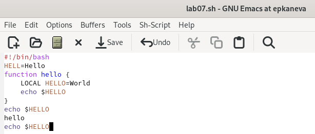
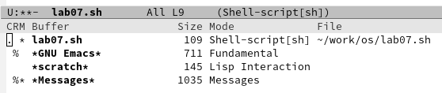
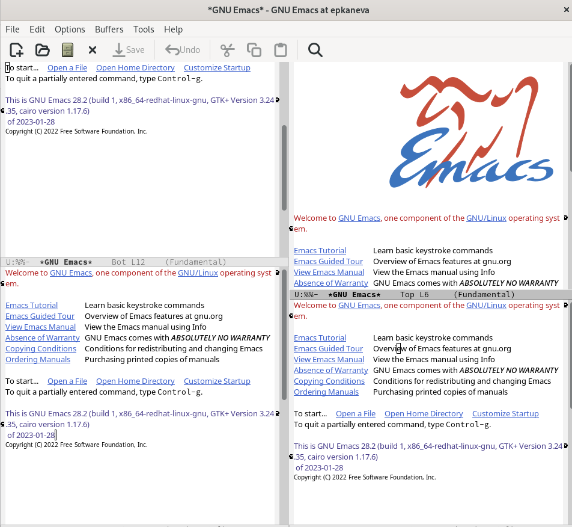
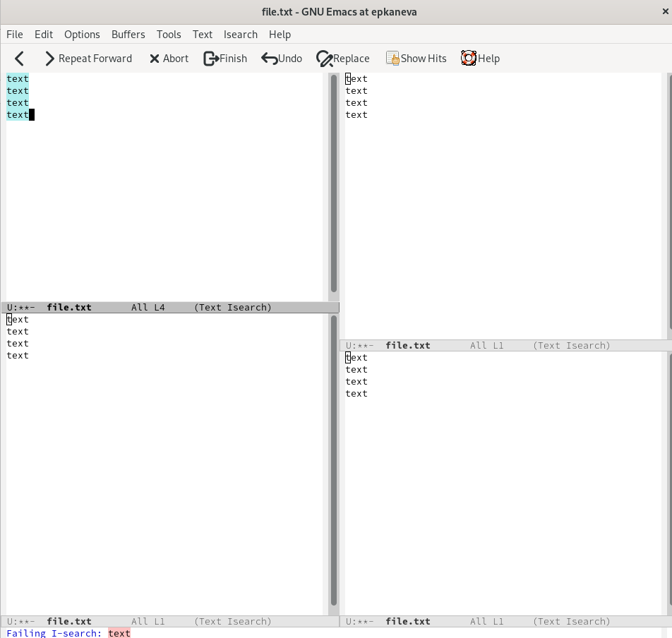

---
## Front matter
lang: ru-RU
title: Лабораторная работа №9
subtitle: Операционные системы
author:
  - Канева Е. П.
institute:
  - Российский университет дружбы народов, Москва, Россия
date: 8 апреля 2023

## i18n babel
babel-lang: russian
babel-otherlangs: english

## Formatting pdf
toc: false
toc-title: Содержание
slide_level: 2
aspectratio: 169
section-titles: true
theme: metropolis
header-includes:
 - \metroset{progressbar=frametitle,sectionpage=progressbar,numbering=fraction}
 - '\makeatletter'
 - '\beamer@ignorenonframefalse'
 - '\makeatother'
---

# Информация

## Докладчик

:::::::::::::: {.columns align=center}
::: {.column width="70%"}

  * Канева Екатерина Павловна
  * Студентка группы НКАбд-02-22
  * Российский университет дружбы народов
  * <https://github.com/Nevseros/study_2022-2023_os-intro>

:::
::::::::::::::

# Вводная часть

## Цель

Познакомиться с операционной системой Linux. Получить практические навыки работы с редактором Emacs.

## Задания

1. Ознакомиться с теоретическим материалом.
2. Ознакомиться с редактором emacs.
3. Выполнить упражнения.
4. Ответить на контрольные вопросы.

# Выполнение работы

## Создание файла

* Открыла emacs, ввела нужный текст, сохранила его (рис. [-@fig:01]):

{#fig:01 width=70%}

## Выделение и вставка текста

* Выделила область текста (C-space), скопировала область в буфер обмена (M-w) и вставила область в конец файла (рис. [-@fig:04]):

{#fig:04 width=70%}

## Другие действия

* Затем с снова выделила область, вырезала её, отменила действие.

* Переместила курсор в начало, в конец строки, в начало буфера, в конец буфера.

## Список активных буферов

* Вывела список активных буферов на экран (рис. [-@fig:05]):

{#fig:05 width=70%}

## Разделение фрейма

* Разделила фрейм на 4 части (рис. [-@fig:07]):

{#fig:07 width=70%}

## Поиск

* Ввод текста и поиск по файлам (рис. [-@fig:08]):

{#fig:08 width=70%}

# Заключение

## Выводы

Познакомилась с операционной системой Linux. Получила практические навыки работы с редактором Emacs.
