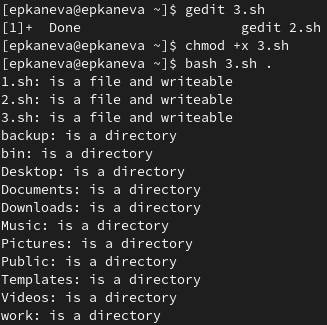

---
## Front matter
lang: ru-RU
title: Лабораторная работа №10
subtitle: Операционные системы
author:
  - Канева Е. П.
institute:
  - Российский университет дружбы народов, Москва, Россия
date: 13 апреля 2023

## i18n babel
babel-lang: russian
babel-otherlangs: english

## Formatting pdf
toc: false
toc-title: Содержание
slide_level: 2
aspectratio: 169
section-titles: true
theme: metropolis
header-includes:
 - \metroset{progressbar=frametitle,sectionpage=progressbar,numbering=fraction}
 - '\makeatletter'
 - '\beamer@ignorenonframefalse'
 - '\makeatother'
---

# Информация

## Докладчик

:::::::::::::: {.columns align=center}
::: {.column width="70%"}

  * Канева Екатерина Павловна
  * Студентка группы НКАбд-02-22
  * Российский университет дружбы народов
  * <https://github.com/Nevseros/study_2022-2023_os-intro>

:::
::::::::::::::

# Вводная часть

## Цель

Изучить основы программирования в оболочке ОС UNIX/Linux. Научиться писать небольшие командные файлы.

## Задания

1. Написать скрипт, который при запуске будет делать резервную копию самого себя (то есть файла, в котором содержится его исходный код) в другую директорию backup в вашем домашнем каталоге. При этом файл должен архивироваться одним из архиваторов на выбор.
2. Написать пример командного файла, обрабатывающего любое произвольное число аргументов командной строки, в том числе превышающее десять.
3. Написать командный файл — аналог команды ls (без использования самой этой команды и команды dir). Требуется, чтобы он выдавал информацию о нужном каталоге и выводил информацию о возможностях доступа к файлам этого каталога.
4. Написать командный файл, который получает в качестве аргумента командной строки формат файла (.txt, .doc, .jpg, .pdf и т.д.) и вычисляет количество таких файлов в указанной директории. Путь к директории также передаётся в виде аргумента командной строки.

# Выполнение работы

## Первое задание

Написала скрипт, требуемый первым заданием (рис. [-@fig:01]) и проверила его работу (рис. [-@fig:02]):

{#fig:01 width=50%}

## Первое задание

{#fig:02 width=50%}

## Второе задание

Написала скрипт, требуемый вторым заданием (рис. [-@fig:03]) и проверила его работу (рис. [-@fig:04]):

{#fig:03 width=50%}

## Второе задание

{#fig:04 width=50%}

## Третье задание

Написала скрипт, требуемый третьим заданием (рис. [-@fig:05]) и проверила его работу (рис. [-@fig:06]):

{#fig:05 width=50%}

## Третье задание

{#fig:06 width=50%}

## Четвёртое задание

Написала скрипт, требуемый четвёртым заданием (рис. [-@fig:07]) и проверила его работу (рис. [-@fig:08]):

{#fig:07 width=70%}

## Четвёртое задание

{#fig:08 width=70%}

# Заключение

## Выводы

Изучила основы программирования в оболочке ОС UNIX/Linux. Научилась писать небольшие командные файлы.
