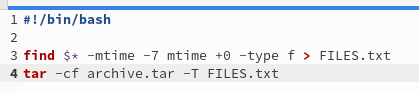

---
## Front matter
lang: ru-RU
title: Лабораторная работа №11
subtitle: Операционные системы
author:
  - Канева Е. П.
institute:
  - Российский университет дружбы народов, Москва, Россия
date: 22 апреля 2023

## i18n babel
babel-lang: russian
babel-otherlangs: english

## Formatting pdf
toc: false
toc-title: Содержание
slide_level: 2
aspectratio: 169
section-titles: true
theme: metropolis
header-includes:
 - \metroset{progressbar=frametitle,sectionpage=progressbar,numbering=fraction}
 - '\makeatletter'
 - '\beamer@ignorenonframefalse'
 - '\makeatother'
---

# Информация

## Докладчик

:::::::::::::: {.columns align=center}
::: {.column width="70%"}

  * Канева Екатерина Павловна
  * Студентка группы НКАбд-02-22
  * Российский университет дружбы народов
  * <https://github.com/Nevseros/study_2022-2023_os-intro>

:::
::::::::::::::

# Вводная часть

## Цель

Изучить основы программирования в оболочке ОС UNIX. Научится писать более
сложные командные файлы с использованием логических управляющих конструкций
и циклов.

## Задания

1. Используя команды getopts grep, написать командный файл, который анализирует
командную строку с ключами, а затем ищет в указанном файле нужные строки, определяемые ключом -p.
2. Написать на языке Си программу, которая вводит число и определяет, является ли оно
большим нуля, меньшим нуля или равным нулю. Затем программа завершается с помощью
функции exit(n), передавая информацию в о коде завершения в оболочку.
3. Написать командный файл, создающий указанное число файлов, пронумерованных
последовательно от 1 до N (например 1.tmp, 2.tmp, 3.tmp,4.tmp и т.д.). Этот же командный 
файл должен уметь удалять все созданные им файлы (если они существуют).
4. Написать командный файл, который с помощью команды tar запаковывает в архив
все файлы в указанной директории так, чтобы запаковывались
только те файлы, которые были изменены менее недели тому назад.

# Выполнение работы

## Первое задание

Создала программу, требуемую заданием 1 (рис. [-@fig:01]) и проверила её работу (рис. [-@fig:02] и [-@fig:04]):

{#fig:01 width=30%}

## Первое задание

{#fig:02 width=40%}

{#fig:04 width=40%}

## Второе задание

Создала программы, требуемые заданием 2 (рис. [-@fig:05] и [-@fig:06]) и проверила их работу (рис. [-@fig:07]):

{#fig:05 width=40%}

## Второе задание

{#fig:06 width=60%}

## Второе задание

{#fig:07 width=50%}

## Третье задание

Создала программу, требуемую заданием 3 (рис. [-@fig:08]) и проверила её работу (рис. [-@fig:09]):

{#fig:08 width=50%}

## Третье задание

{#fig:09 width=70%}

## Четвёртое задание

Создала программу, требуемую заданием 4 (рис. [-@fig:10]) и проверила её работу (рис. [-@fig:11] и [-@fig:12]):

{#fig:10 width=70%}

## Четвёртое задание

{#fig:12 width=60%}

# Заключение

## Выводы

Изучила основы программирования в оболочке ОС UNIX. Научилась писать более
сложные командные файлы с использованием логических управляющих конструкций
и циклов.
