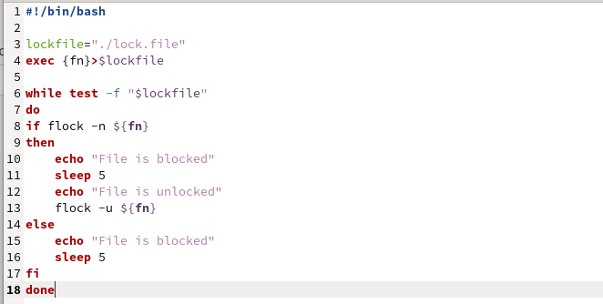
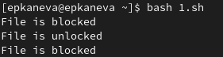
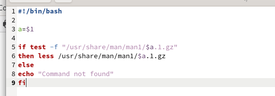
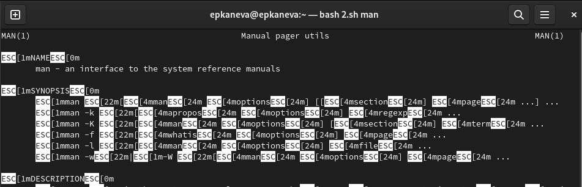
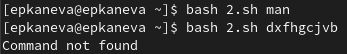
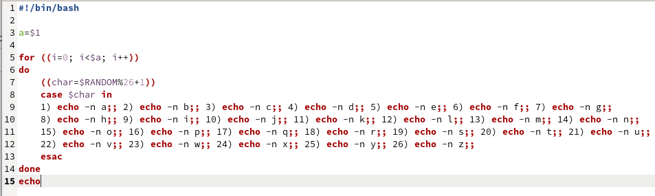
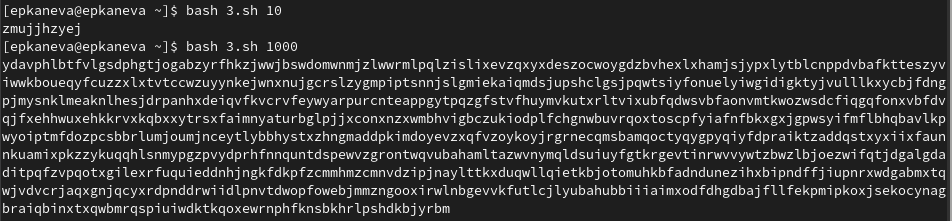

---
## Front matter
lang: ru-RU
title: Лабораторная работа №12
subtitle: Операционные системы
author:
  - Канева Е. П.
institute:
  - Российский университет дружбы народов, Москва, Россия
date: 27 апреля 2023

## i18n babel
babel-lang: russian
babel-otherlangs: english

## Formatting pdf
toc: false
toc-title: Содержание
slide_level: 2
aspectratio: 169
section-titles: true
theme: metropolis
header-includes:
 - \metroset{progressbar=frametitle,sectionpage=progressbar,numbering=fraction}
 - '\makeatletter'
 - '\beamer@ignorenonframefalse'
 - '\makeatother'
---

# Информация

## Докладчик

:::::::::::::: {.columns align=center}
::: {.column width="70%"}

  * Канева Екатерина Павловна
  * Студентка группы НКАбд-02-22
  * Российский университет дружбы народов
  * <https://github.com/Nevseros/study_2022-2023_os-intro>

:::
::::::::::::::

# Вводная часть

## Цель

Изучить основы программирования в оболочке ОС UNIX. Научиться писать более сложные командные файлы с использованием логических управляющих конструкций и циклов.

## Задания

1. Написать командный файл, реализующий упрощённый механизм семафоров. Доработать программу так, чтобы имелась возможность взаимодействия трёх и более процессов.
2. Реализовать команду man с помощью командного файла.
3. Используя встроенную переменную `$RANDOM`, написать командный файл, генерирующий случайную последовательность букв латинского алфавита.

# Выполнение работы

## Первое задание

Создала программу, требуемую заданием 1 (рис. [-@fig:01]) и проверила её работу (рис. [-@fig:02]):

{#fig:01 width=30%}

## Первое задание

{#fig:02 width=40%}

## Второе задание

Создала программу, требуемые заданием 2 (рис. [-@fig:03]), и проверила её работу (рис. [-@fig:04] и [-@fig:05]):

{#fig:03 width=40%}

## Второе задание

{#fig:04 width=60%}

## Второе задание

{#fig:05 width=70%}

## Третье задание

Создала программу, требуемую заданием 3 (рис. [-@fig:06]) и проверила её работу (рис. [-@fig:07]):

{#fig:06 width=50%}

## Третье задание

{#fig:07 width=70%}

# Заключение

## Выводы

Изучила основы программирования в оболочке ОС UNIX. Научилась писать более сложные командные файлы с использованием логических управляющих конструкций и циклов.
