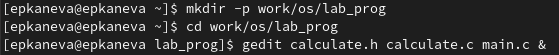
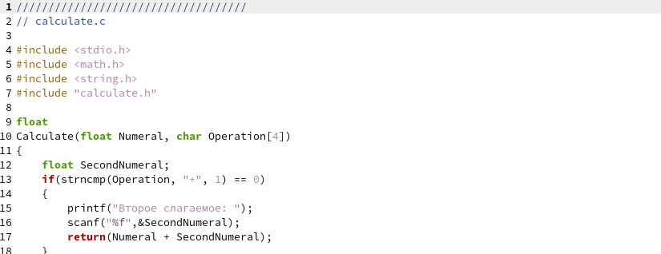
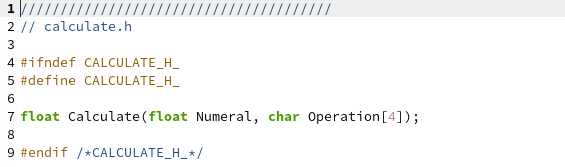
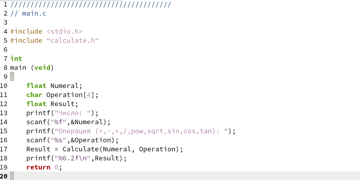
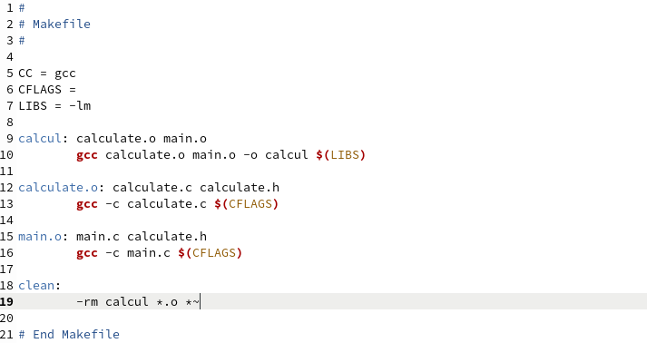
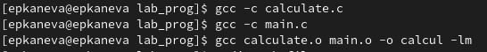
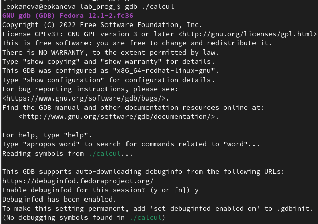
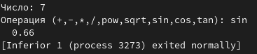
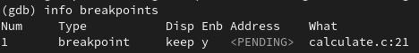
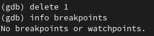

---
## Front matter
lang: ru-RU
title: Лабораторная работа №13
subtitle: Операционные системы
author:
  - Канева Е. П.
institute:
  - Российский университет дружбы народов, Москва, Россия
date: 4 мая 2023

## i18n babel
babel-lang: russian
babel-otherlangs: english

## Formatting pdf
toc: false
toc-title: Содержание
slide_level: 2
aspectratio: 169
section-titles: true
theme: metropolis
header-includes:
 - \metroset{progressbar=frametitle,sectionpage=progressbar,numbering=fraction}
 - '\makeatletter'
 - '\beamer@ignorenonframefalse'
 - '\makeatother'
---

# Информация

## Докладчик

:::::::::::::: {.columns align=center}
::: {.column width="70%"}

  * Канева Екатерина Павловна
  * Студентка группы НКАбд-02-22
  * Российский университет дружбы народов
  * <https://github.com/Nevseros/study_2022-2023_os-intro>

:::
::::::::::::::

# Вводная часть

## Цель

Приобрести простейшие навыки разработки, анализа, тестирования и отладки приложений в ОС типа UNIX/Linux на примере создания на языке программирования С калькулятора с простейшими функциями.

## Задания

1. Написать программные файлы.
2. Скомпилировать их с помощью `gcc`.
3. Отладить их с помощью `gdb`.
4. Проанализировать код с помощью утилиты `splint`.

# Выполнение работы

## Создание файлов

Создала нужные каталог и файлы (рис. [-@fig:01]):

{#fig:01 width=70%}

## Текст файлов

Далее перенесла текст программных файлов и Makefile (рис. [-@fig:02], [-@fig:03], [-@fig:04] и [-@fig:05]):

{#fig:02 width=50%}

## Текст файлов

{#fig:03 width=50%}

## Текст файлов

{#fig:04 width=50%}

## Текст файлов

{#fig:05 width=50%}

## Компиляция

Выполнила компиляцию программы (рис. [-@fig:06]):

{#fig:06 width=50%}

## Запуск отладчика

Запустила отладчик GDB (рис. [-@fig:07]):

{#fig:07 width=50%}

## Запуск программы

В отладчике с помощью команды `run` запустила программу (рис. [-@fig:08]):

{#fig:08 width=50%}

## Добавление брейкпоинтов

Добавила брейкпоинт и проверила его наличие с помощью команды `info breakpoints` (рис. [-@fig:09]):

{#fig:09 width=50%}

## Удаление брейкпоинта

Удалила брейкпоинт с помощью команды `delete 1` (рис. [-@fig:10]):

{#fig:10 width=50%}

## Анализ кода

С помощью утилиты `splint` проанализировали коды файлов `calculate.c` (рис. [-@fig:11]) и `main.c` (рис. [-@fig:12]):

{#fig:11 width=50%}

## Анализ кода

{#fig:12 width=50%}

# Заключение

## Выводы

Приобрела простейшие навыки разработки, анализа, тестирования и отладки приложений в ОС типа UNIX/Linux на примере создания на языке программирования С калькулятора с простейшими функциями.
