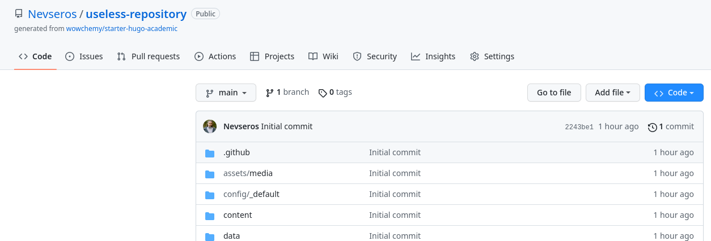
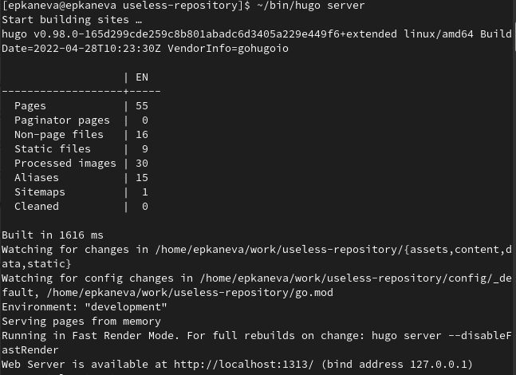
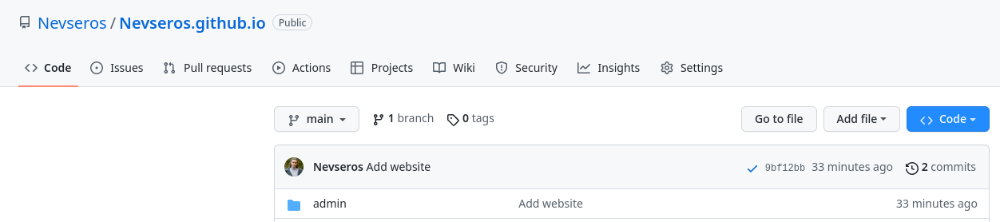
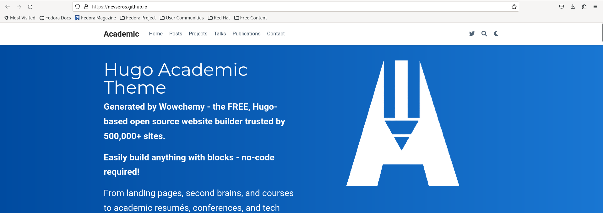

---
## Front matter
lang: ru-RU
title: Индивидуальный проект. Этап 1
subtitle: Операционные системы
author:
  - Канева Е.П., НКАбд-02-22

## i18n babel
babel-lang: russian
babel-otherlangs: english

## Formatting pdf
toc: false
toc-title: Содержание
slide_level: 2
aspectratio: 169
section-titles: true
theme: metropolis
header-includes:
 - \metroset{progressbar=frametitle,sectionpage=progressbar,numbering=fraction}
 - '\makeatletter'
 - '\beamer@ignorenonframefalse'
 - '\makeatother'
---

# Вводная часть

## Цель

Базово настроить каталоги для сайта и сделать сайт публичным.

# Выполнение лабораторной работы

## Hugo - скачивание и распаковка

Сначала скачали нужный архив `hugo`, распаковали его и переместили файл `hugo` в другой каталог (рис. [-@fig:001]):

{#fig:001 width=70%}

## Создание репозитория по шаблону

С помощью [шаблона](https://github.com/wowchemy/starter-hugo-academic) создадим новый репозиторий (рис. [-@fig:002]):

{#fig:002 width=70%}

## Запуск локального сервера

Теперь выполняем следующую команду (рис. [-@fig:006]):

```
~/bin/hugo server
```

{#fig:006 width=50%}

## Репозиторий сайта

Далее создаём новый репозиторий --- будущий репозиторий сайта. Назовём его `Nevseros.github.io` (рис. [-@fig:007]). Позже клонировали его в каталог `~/work`.

{#fig:007 width=70%}

## Подмодуль

Далее сделаем новый репозиторий подмодулем каталога `public`, для этого введём следующую команду (рис. [-@fig:010]):

```
git submodule add -b main git@github.com:Nevseros/Nevseros.github.io.git public
```

{#fig:010 width=70%}

## Создаём нужные файлы

Далее выполним команду `hugo`, чтобы создать нужные файлы (рис. [-@fig:011]):

{#fig:011 width=70%}

## Сайт

Теперь сайт работает (рис. [-@fig:013]):

{#fig:013 width=70%}

# Заключение

## Выводы

Настроили необходимые для сайта каталоги и сделали сайт публичным.
