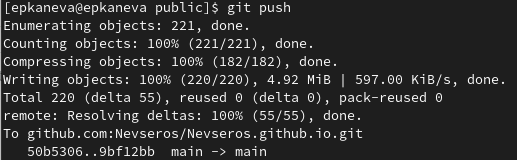

---
## Front matter
title: "Индивидуальный проект. Этап 1"
subtitle: "Операционные системы"
author: "Екатерина Павловна Канева"

## Generic otions
lang: ru-RU
toc-title: "Содержание"

## Bibliography
bibliography: bib/cite.bib
csl: pandoc/csl/gost-r-7-0-5-2008-numeric.csl

## Pdf output format
toc: true # Table of contents
toc-depth: 2
lof: true # List of figures
lot: true # List of tables
fontsize: 12pt
linestretch: 1.5
papersize: a4
documentclass: scrreprt
## I18n polyglossia
polyglossia-lang:
  name: russian
  options:
	- spelling=modern
	- babelshorthands=true
polyglossia-otherlangs:
  name: english
## I18n babel
babel-lang: russian
babel-otherlangs: english
## Fonts
mainfont: PT Serif
romanfont: PT Serif
sansfont: PT Sans
monofont: PT Mono
mainfontoptions: Ligatures=TeX
romanfontoptions: Ligatures=TeX
sansfontoptions: Ligatures=TeX,Scale=MatchLowercase
monofontoptions: Scale=MatchLowercase,Scale=0.9
## Biblatex
biblatex: true
biblio-style: "gost-numeric"
biblatexoptions:
  - parentracker=true
  - backend=biber
  - hyperref=auto
  - language=auto
  - autolang=other*
  - citestyle=gost-numeric
## Pandoc-crossref LaTeX customization
figureTitle: "Рис."
tableTitle: "Таблица"
listingTitle: "Листинг"
lofTitle: "Список иллюстраций"
lotTitle: "Список таблиц"
lolTitle: "Листинги"
## Misc options
indent: true
header-includes:
  - \usepackage{indentfirst}
  - \usepackage{float} # keep figures where there are in the text
  - \floatplacement{figure}{H} # keep figures where there are in the text
---

# Цель работы

Базово настроить каталоги для сайта и сделать сайт публичным.

# Выполнение лабораторной работы

Сначала скачаем с сайта github по [этой](https://github.com/gohugoio/hugo/releases) ссылке архив hugo (рис. [-@fig:001]):

{#fig:001 width=70%}

Затем архив извлекли, создали папку `bin` в домашнем каталоге, туда переместили файл `hugo` (рис. [-@fig:002]):

{#fig:002 width=70%}

После этого с помощью [шаблона](https://github.com/wowchemy/starter-hugo-academic) создадим новый репозиторий, назовём его `useless-repository` (рис. [-@fig:003]):

{#fig:003 width=70%}

Далее репозиторий был клонирован (рис. [-@fig:004]):

{#fig:004 width=70%}

Затем ввели команду `~/bin/hugo` (рис. [-@fig:005]):

{#fig:005 width=70%}

После этого удаляем каталог `public`, потому что он оказался не нужным (пока). Теперь выполняем следующую команду (рис. [-fig:006]):

```
~/bin/hugo server
```

{#fig:006 width=70%}

После этого по указанному адресу в браузере имели возможность открыть сайт, доступный пока что только локально. Далее создаём новый репозиторий --- будущий репозиторий сайта. Назовём его `Nevseros.github.io` (рис. [-@fig:007]):

{#fig:007 width=70%}

Этот репозиторий клонируем в каталог `work` рядом с каталогом `useless-repository` (рис. [-@fig:008]):

{#fig:008 width=70%}

Далее, чтобы сделать новый репозиторий подмодулем каталога `public`, уберём каталог `public` из файла `.gitignore` (рис. [-@fig:009]):

{#fig:009 width=70%}

Далее сделаем новый репозиторий подмодулем каталога `public`, для этого введём следующую команду (рис. [-@fig:010]):

```
git submodule add -b main git@github.com:Nevseros/Nevseros.github.io.git public
```

{#fig:010 width=70%}

Далее выполним команду (рис. [-@fig:011]):

```
~/bin/hugo
```

{#fig:011 width=70%}

Теперь в каталоге `public` появились новые файлы, которые мы отправляем на удалённый репозиторий (рис. [-@fig:012]):

{#fig:012 width=70%}

Поскольку это был последний этап, теперь сайт должен работать и быть публичным. Проверили это (рис. [-@fig:013]):

{#fig:013 width=70%}

# Выводы

Настроили необходимые для сайта каталоги и сделали сайт публичным.
