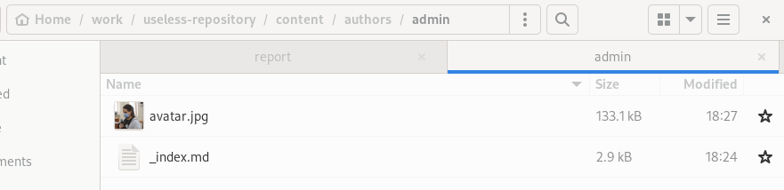
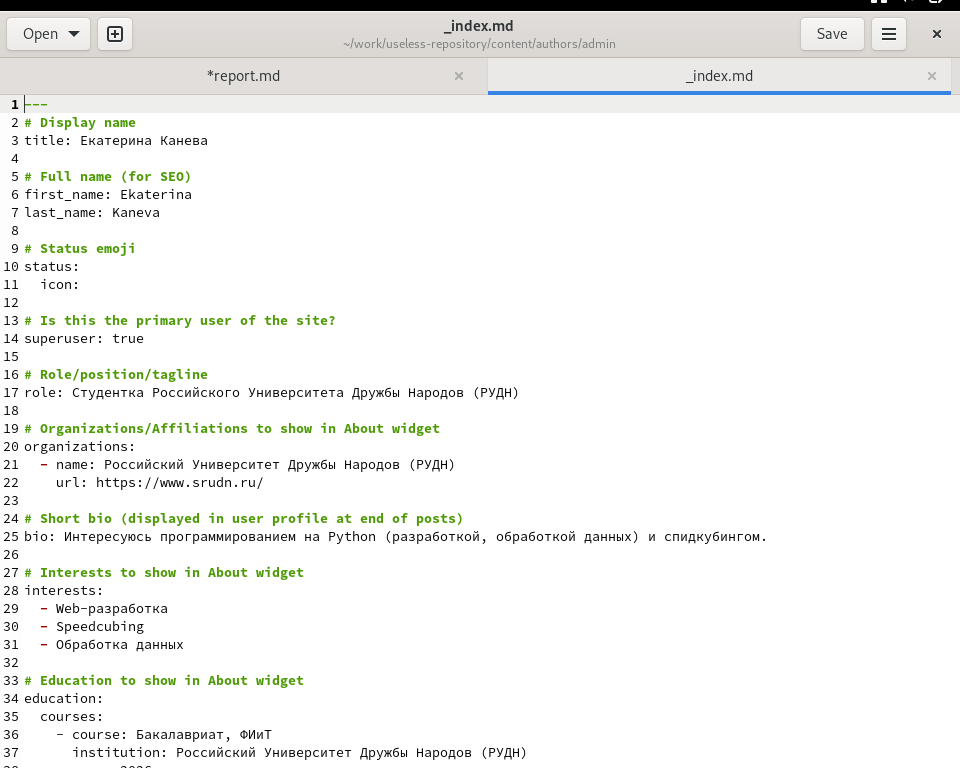
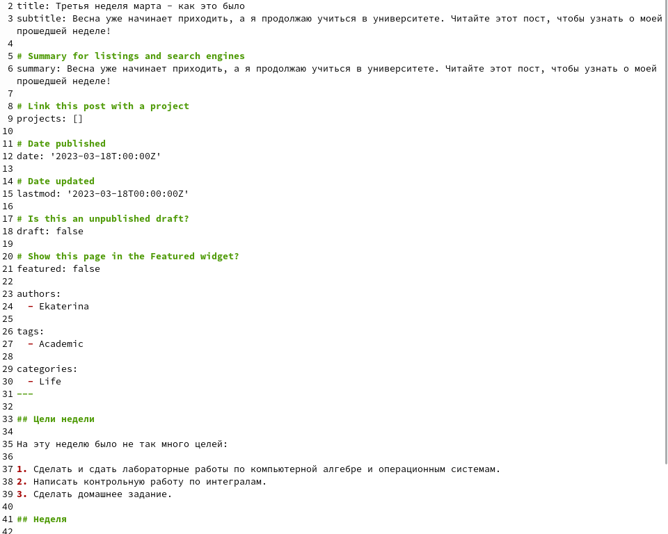
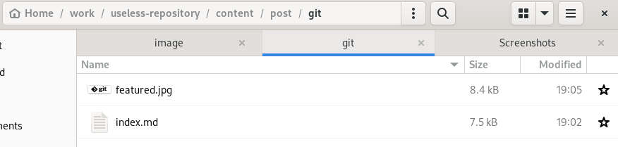
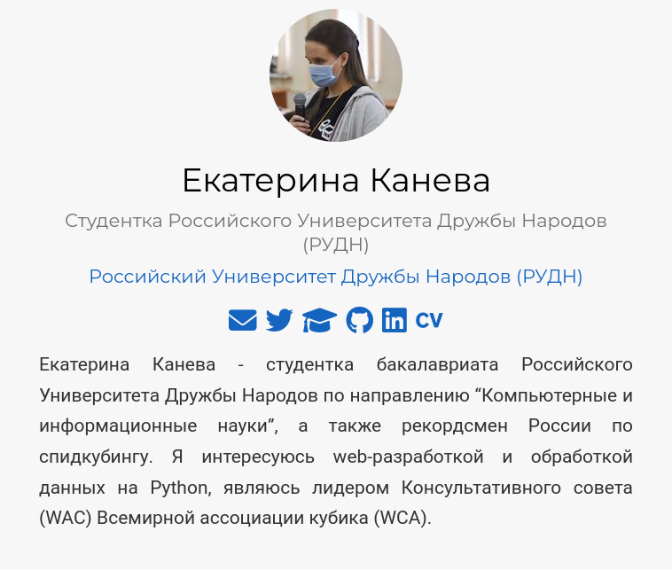
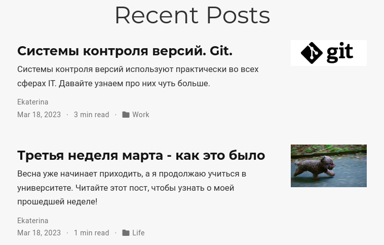

---
## Front matter
lang: ru-RU
title: Индивидуальный проект. Этап 2
subtitle: Операционные системы
author:
  - Канева Е.П., НКАбд-02-22

## i18n babel
babel-lang: russian
babel-otherlangs: english

## Formatting pdf
toc: false
toc-title: Содержание
slide_level: 2
aspectratio: 169
section-titles: true
theme: metropolis
header-includes:
 - \metroset{progressbar=frametitle,sectionpage=progressbar,numbering=fraction}
 - '\makeatletter'
 - '\beamer@ignorenonframefalse'
 - '\makeatother'
---

# Информация

## Докладчик

:::::::::::::: {.columns align=center}
::: {.column width="70%"}

  * Канева Екатерина Павловна
  * студентка НКАбд-02-22
  * Российский Университет Дружбы Народов
  * <https://nevseros.github.io/ru/>

:::
::::::::::::::

# Вводная часть

## Цель

Добавить на сайт данные о себе, создать 2 поста.

## Задачи

1. Список добавляемых данных:

* Разместить фотографию владельца сайта.
* Разместить краткое описание владельца сайта (Biography).
* Добавить информацию об интересах (Interests).
* Добавить информацию от образовании (Education).
    
2. Сделать пост по прошедшей неделе.
3. Добавить пост на тему по выбору:

* Управление версиями. Git.
* Непрерывная интеграция и непрерывное развертывание (CI/CD).

# Выполнение работы

## Запуск локального сервера

Для начала, чтобы отслеживать изменения, я запустила локальный сервер с сайтом. Для этого в терминале была введена команда:

```
~/bin/hugo server
```

## Изменение аватарки

Сначала я изменила фотографию владельца сайта (рис. [-@fig:01]):

{#fig:01 width=70%}

## Изменение биографии

Далее я изменила информацию о себе - биографию, интересы, образование. Для этого в том же каталоге я отредактировала файл `_index.md` (рис. [-@fig:01]).

## Изменение биографии

{#fig:02 width=50%}

## Написание поста о прошедшей неделе

Потом я перешла к написанию двух постов. Первый пост был о прошедшей неделе. Для его написания я перешла в каталог `~/work/useless-repository/content/post`, создала там каталог `march-third-week` и в этом каталоге в созданном файле `index.md` описала прошедшую неделю (рис. [-@fig:03]).

## Написание поста о прошедшей неделе

{#fig:03 width=50%}

## Написание поста о системах контроля версий

Следующим я написала пост о системах контроля версий и системе git в частности. Он писался подобно предыдущему посту (рис. [-@fig:04]). К этому посту я дополнительно добавила логотип git (рис. [-@fig:05]).

## Написание поста о системах контроля версий

{#fig:04 width=50%}

## Написание поста о системах контроля версий

{#fig:05 width=70%}

## Отправление изменений на удалённый сервер

Теперь нужно было отправить изменения на удалённый сервер, чтобы они отразились на сайте [nevseros.github.io](https://nevseros.github.io). Для этого ввели следующие команды:

```
~/bin/hugo
git commit -am "add bio and first two posts"
git push
cd public
git commit -am "rebuild the website"
git push
```

## Изменения на сайте

Теперь изменения отразились и на самом публичном сайте (рис. [-@fig:08] и [-@fig:09]).

## Изменения на сайте

{#fig:08 width=50%}

## Изменения на сайте

{#fig:09 width=60%}

# Заключение

## Выводы

Добавили на сайт данные о себе, создали 2 поста.
