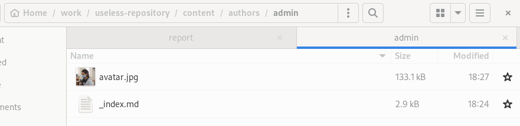
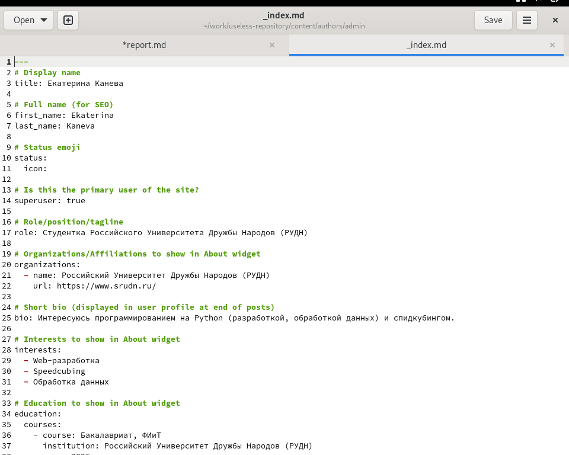
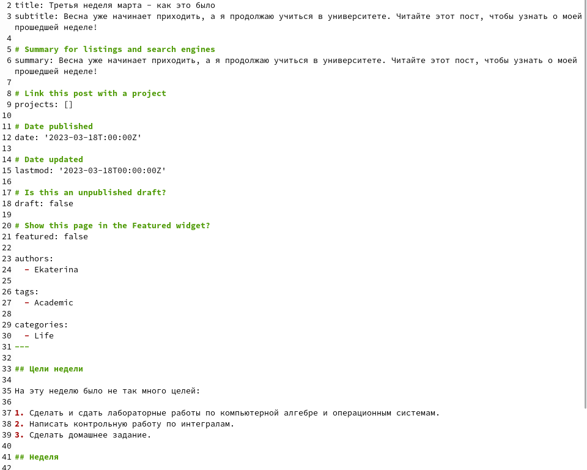
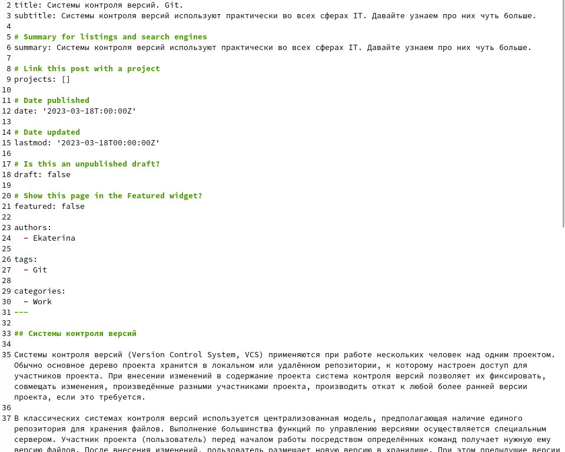
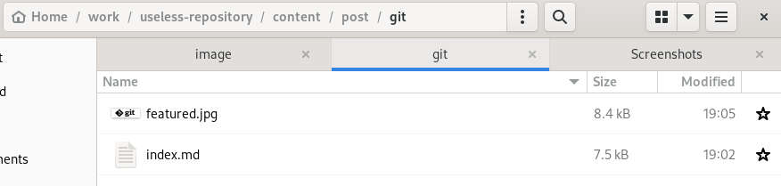
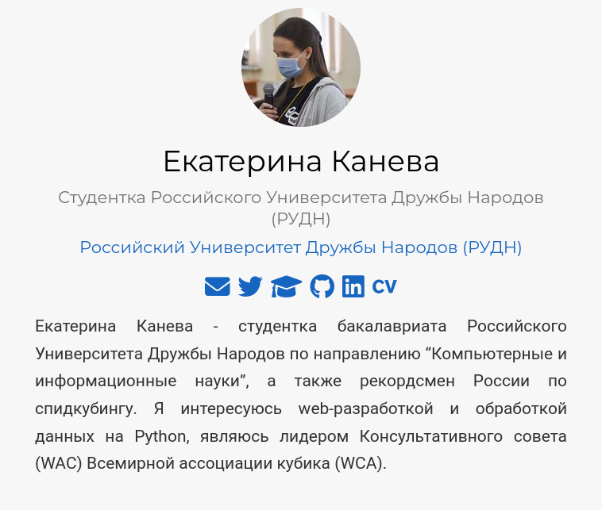
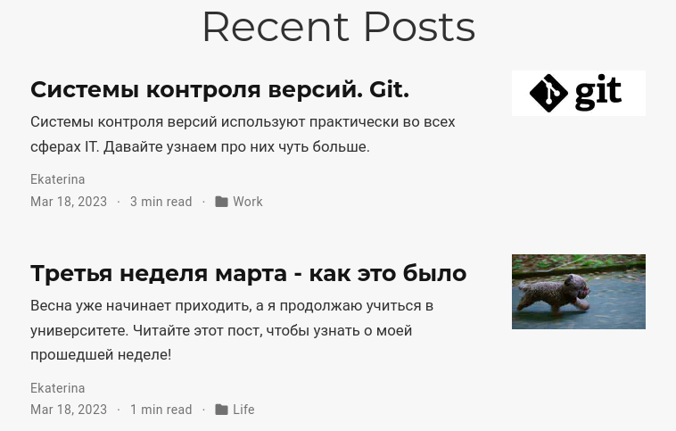

---
## Front matter
title: "Индивидуальный проект. Второй этап"
subtitle: "Операционные системы"
author: "Екатерина Павловна Канева"

## Generic otions
lang: ru-RU
toc-title: "Содержание"

## Bibliography
bibliography: bib/cite.bib
csl: pandoc/csl/gost-r-7-0-5-2008-numeric.csl

## Pdf output format
toc: true # Table of contents
toc-depth: 2
lof: true # List of figures
lot: true # List of tables
fontsize: 12pt
linestretch: 1.5
papersize: a4
documentclass: scrreprt
## I18n polyglossia
polyglossia-lang:
  name: russian
  options:
	- spelling=modern
	- babelshorthands=true
polyglossia-otherlangs:
  name: english
## I18n babel
babel-lang: russian
babel-otherlangs: english
## Fonts
mainfont: PT Serif
romanfont: PT Serif
sansfont: PT Sans
monofont: PT Mono
mainfontoptions: Ligatures=TeX
romanfontoptions: Ligatures=TeX
sansfontoptions: Ligatures=TeX,Scale=MatchLowercase
monofontoptions: Scale=MatchLowercase,Scale=0.9
## Biblatex
biblatex: true
biblio-style: "gost-numeric"
biblatexoptions:
  - parentracker=true
  - backend=biber
  - hyperref=auto
  - language=auto
  - autolang=other*
  - citestyle=gost-numeric
## Pandoc-crossref LaTeX customization
figureTitle: "Рис."
tableTitle: "Таблица"
listingTitle: "Листинг"
lofTitle: "Список иллюстраций"
lotTitle: "Список таблиц"
lolTitle: "Листинги"
## Misc options
indent: true
header-includes:
  - \usepackage{indentfirst}
  - \usepackage{float} # keep figures where there are in the text
  - \floatplacement{figure}{H} # keep figures where there are in the text
---

# Цель работы

Добавить на сайт данные о себе, создать 2 поста.

# Задание

1. Список добавляемых данных:

* Разместить фотографию владельца сайта.
* Разместить краткое описание владельца сайта (Biography).
* Добавить информацию об интересах (Interests).
* Добавить информацию от образовании (Education).
    
2. Сделать пост по прошедшей неделе.
3. Добавить пост на тему по выбору:

* Управление версиями. Git.
* Непрерывная интеграция и непрерывное развертывание (CI/CD).

# Теоретическое введение

Сайт (website) – это совокупность веб-страниц, объединённых под общим доменом и связанных ссылками, тематикой и дизайнерским оформлением. Мы будем создавать статический сайт, для этого нам понадобится Hugo.
Hugo — генератор статических страниц для интернета.

# Выполнение лабораторной работы

* Для начала, чтобы отслеживать изменения, я запустила локальный сервер с сайтом. Для этого в терминале была введена команда `~/bin/hugo server`.

* Сначала я изменила фотографию владельца сайта. Для этого я перешла в каталог `~/work/useless-repository/content/authors/admins` и заменила существующую картинку `avatar.jpg` на свою фотографию (рис. [-@fig:01]):

{#fig:01 width=70%}

* Далее я изменила информацию о себе - биографию, интересы, образование. Для этого в том же каталоге я отредактировала файл `_index.md` (рис. [-@fig:01]):

{#fig:02 width=70%}

* Потом я перешла к написанию двух постов. Первый пост был о прошедшей неделе. Для его написания я перешла в каталог `~/work/useless-repository/content/post`, создала там каталог `march-third-week` и в этом каталоге в созданном файле `index.md` описала прошедшую неделю (рис. [-@fig:03]):

{#fig:03 width=70%}

* Следующим я написала пост о системах контроля версий и системе git в частности. Он писался подобно предыдущему посту (рис. [-@fig:04]). К этому посту я дополнительно добавила логотип git (рис. [-@fig:05]):

{#fig:04 width=70%}

{#fig:05 width=70%}

Теперь надо было проверить, всё ли поменялось на локальной версии сайта. Для этого я перешла на этот сайт и проверила биографию (рис. [-@fig:06]) и посты (рис. [-@fig:07]):

{#fig:06 width=70%}

{#fig:07 width=70%}

Теперь нужно было отправить изменения на удалённый сервер, чтобы они отразились на сайте [nevseros.github.io](https://nevseros.github.io). Для этого ввели следующие команды:

```
~/bin/hugo
git add .
git commit -m "add bio and first two posts"
git push
cd public
git add .
git commit -m "rebuild the website"
git push
```

Теперь изменения отразились и на самом публичном сайте (рис. [-@fig:08] и [-@fig:09]):

{#fig:08 width=70%}

{#fig:09 width=70%}

# Выводы

Добавили на сайт данные о себе, создали 2 поста.
