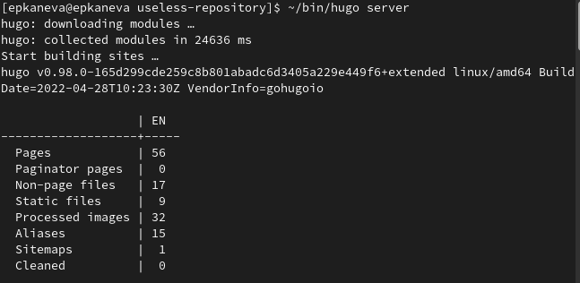
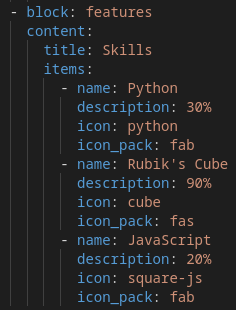
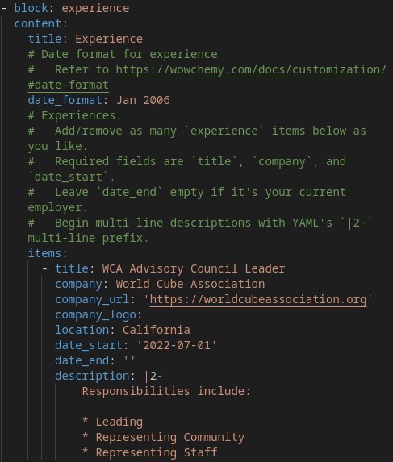
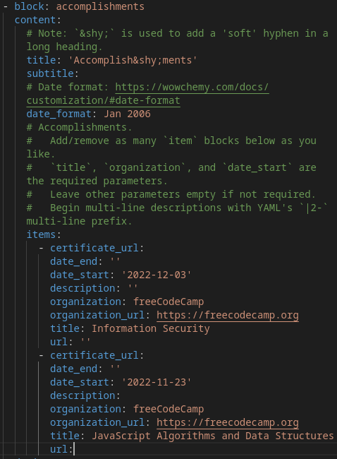
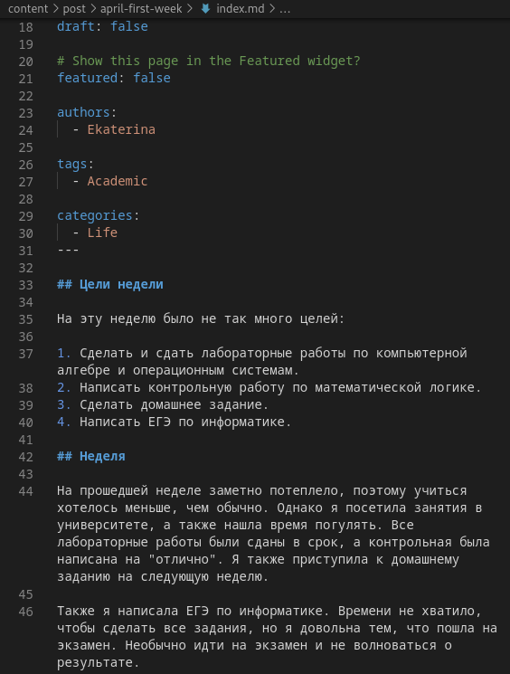
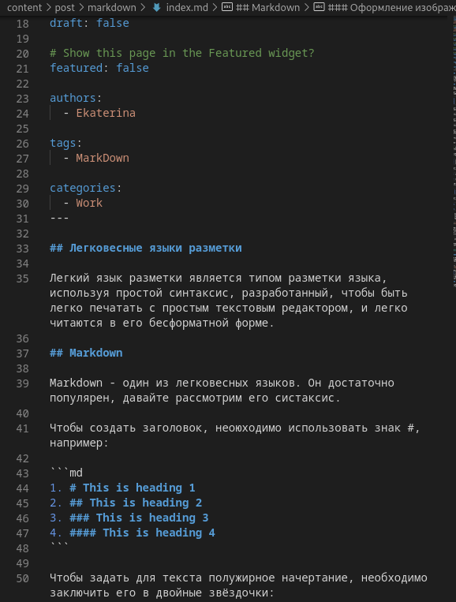
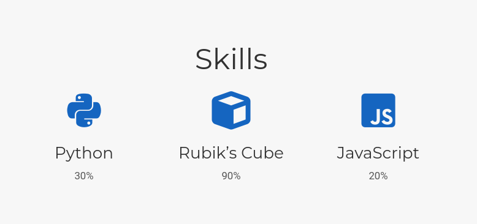
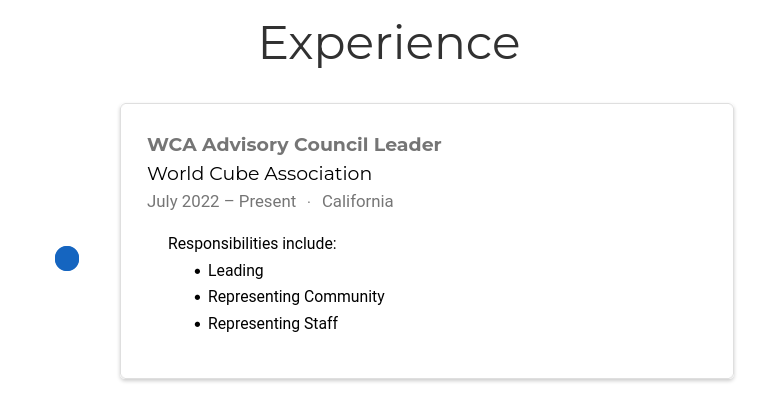
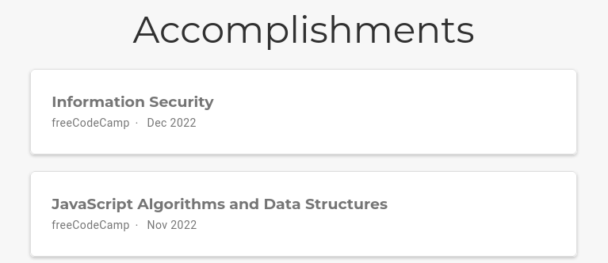
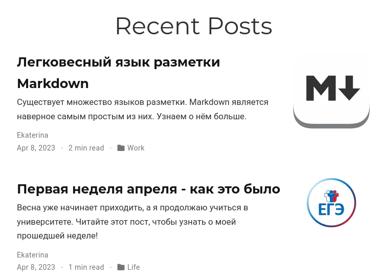

---
## Front matter
lang: ru-RU
title: Индивидуальный проект. Этап 3
subtitle: Операционные системы
author:
  - Канева Е.П., НКАбд-02-22

## i18n babel
babel-lang: russian
babel-otherlangs: english

## Formatting pdf
toc: false
toc-title: Содержание
slide_level: 2
aspectratio: 169
section-titles: true
theme: metropolis
header-includes:
 - \metroset{progressbar=frametitle,sectionpage=progressbar,numbering=fraction}
 - '\makeatletter'
 - '\beamer@ignorenonframefalse'
 - '\makeatother'
---

# Информация

## Докладчик

:::::::::::::: {.columns align=center}
::: {.column width="70%"}

  * Канева Екатерина Павловна
  * студентка НКАбд-02-22
  * Российский Университет Дружбы Народов
  * <https://nevseros.github.io/ru/>

:::
::::::::::::::

# Вводная часть

## Цель

Добавить достижения, опыт, скиллы и посты.

## Задания

1. Добавить информацию о навыках (Skills).
2. Добавить информацию об опыте (Experience).
3. Добавить информацию о достижениях (Accomplishments).
4. Сделать пост по прошедшей неделе.
5. Добавить пост на тему по выбору:

* Легковесные языки разметки.
* Языки разметки. LaTeX.
* Язык разметки Markdown.

# Выполнение работы

## Запуск сервера

Запустила локальный сервер сайта (рис. [-@fig:01]):

{#fig:01 width=70%}

## Скиллы

Отредактировала информацию о скиллах (рис. [-@fig:02]), опыте (рис. [-@fig:03]) и достижениях (рис. [-@fig:04]):

{#fig:02 width=50%}

## Опыт

{#fig:03 width=40%}

## Достижения

{#fig:04 width=40%}

## Пост о прошедшей неделе

Добавила пост о прошедшей неделе (рис. [-@fig:05]):

{#fig:05 width=70%}

## Пост о Markdown

Добавила пост о языке разметки Markdown (рис. [-@fig:06]):

{#fig:06 width=70%}

## Изменения на сайте

Все изменения появились на сайте (рис. [-@fig:07], [-@fig:08], [-@fig:09] и [-@fig:10]):

{#fig:07 width=70%}

## Изменения на сайте

{#fig:08 width=70%}

## Изменения на сайте

{#fig:09 width=70%}

## Изменения на сайте

{#fig:10 width=70%}

# Заключение

## Выводы

Добавила новую информацию о себе на сайт.

