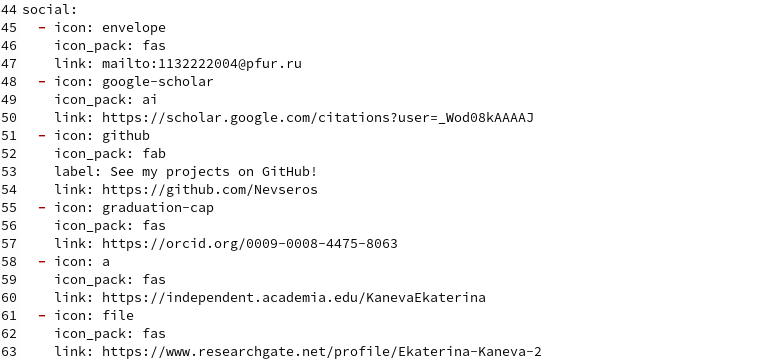
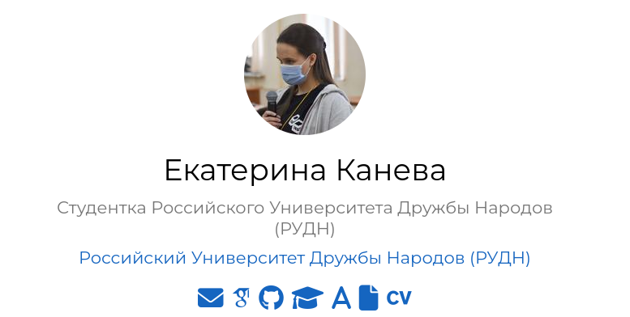
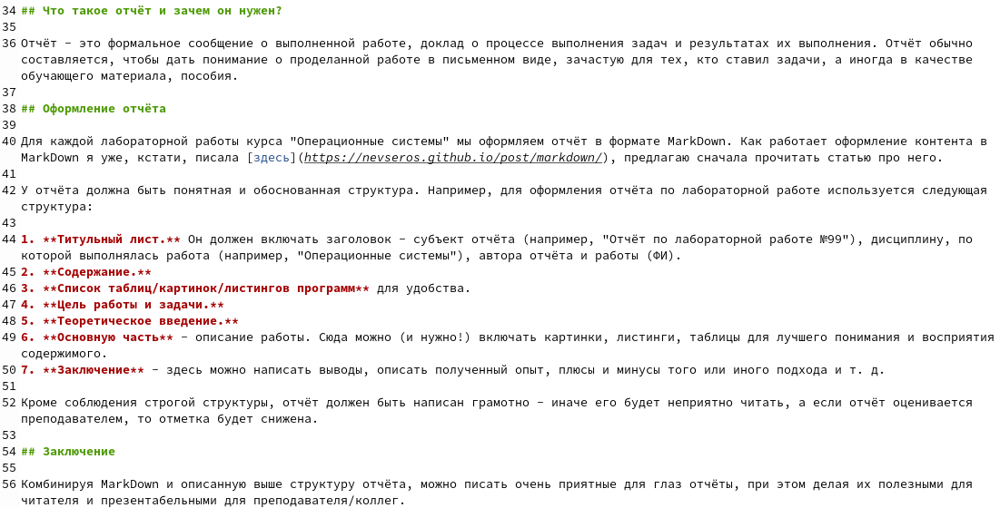
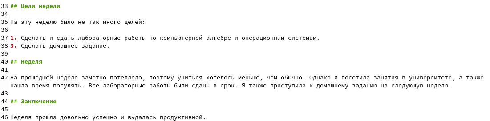
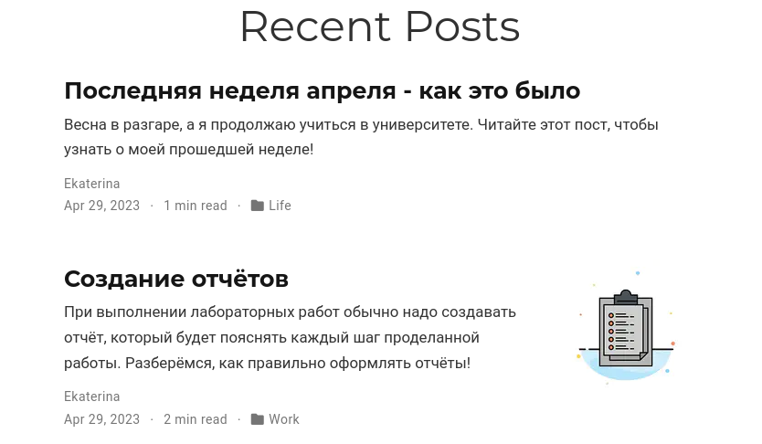

---
## Front matter
lang: ru-RU
title: Индивидуальный проект. Этап 4
subtitle: Операционные системы
author:
  - Канева Е.П., НКАбд-02-22

## i18n babel
babel-lang: russian
babel-otherlangs: english

## Formatting pdf
toc: false
toc-title: Содержание
slide_level: 2
aspectratio: 169
section-titles: true
theme: metropolis
header-includes:
 - \metroset{progressbar=frametitle,sectionpage=progressbar,numbering=fraction}
 - '\makeatletter'
 - '\beamer@ignorenonframefalse'
 - '\makeatother'
---

# Информация

## Докладчик

:::::::::::::: {.columns align=center}
::: {.column width="70%"}

  * Канева Екатерина Павловна
  * студентка НКАбд-02-22
  * Российский Университет Дружбы Народов
  * <https://nevseros.github.io/ru/>

:::
::::::::::::::

# Вводная часть

## Цель

Добавить ссылки на библиографические ресурсы и посты.

## Задания

1. Зарегистрироваться на соответствующих ресурсах и разместить на них ссылки на сайте: eLibrary, Google Scholar, ORCID, Mendeley, ResearchGate, Academia.edu, arXiv, GitHub.
2. Сделать пост по прошедшей неделе.
3. Добавить пост на тему по выбору:

* Оформление отчёта.
* Создание презентаций.
* Работа с библиографией.

# Выполнение работы

## Запуск локального сервера и отправка изменений

Чтобы следить за изменениями локально, в самом начале была введена команда:

```
~/bin/hugo server
```

Чтобы изменения были отражены и на самом сайте, была введена команда ниже и изменения были отправлены на удалённый репозиторий на GitHub:

```
~/bin/hugo
```

## Ссылки на ресурсы

Зарегистрировалась на необходимых сайтах, добавила ссылки на них (рис. [-@fig:01] и [-@fig:02]):

{#fig:01 width=50%}

## Изменения на сайте

{#fig:02 width=60%}

## Посты

Написала 2 поста - об оформлении отчётов (рис. [-@fig:03]) и о прошедшей неделе (рис. [-@fig:04]):

{#fig:03 width=50%}

## Посты

{#fig:04 width=70%}

## Изменения на сайте

Проверила изменения на сайте (рис. [-@fig:05]):

{#fig:05 width=70%}

# Заключение

## Выводы

Добавила новую информацию о себе на сайт.
