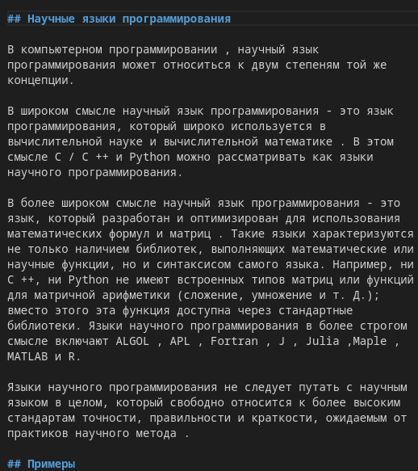

---
## Front matter
lang: ru-RU
title: Индивидуальный проект. Этап 5
subtitle: Операционные системы
author:
  - Канева Е.П., НКАбд-02-22

## i18n babel
babel-lang: russian
babel-otherlangs: english

## Formatting pdf
toc: false
toc-title: Содержание
slide_level: 2
aspectratio: 169
section-titles: true
theme: metropolis
header-includes:
 - \metroset{progressbar=frametitle,sectionpage=progressbar,numbering=fraction}
 - '\makeatletter'
 - '\beamer@ignorenonframefalse'
 - '\makeatother'
---

# Информация

## Докладчик

:::::::::::::: {.columns align=center}
::: {.column width="70%"}

  * Канева Екатерина Павловна
  * студентка НКАбд-02-22
  * Российский Университет Дружбы Народов
  * <https://nevseros.github.io/ru/>

:::
::::::::::::::

# Вводная часть

## Цель

Добавить ссылки на библиографические ресурсы и посты.

## Задания

1. Добавить записи о персональных проектах.
2. Сделать пост по прошедшей неделе.
3. Добавить пост на тему "Языки научного программирования".

# Выполнение работы

## Запуск локального сервера и отправка изменений

Чтобы следить за изменениями локально, в самом начале была введена команда:

```
~/bin/hugo server
```

Чтобы изменения были отражены и на самом сайте, была введена команда ниже и изменения были отправлены на удалённый репозиторий на GitHub:

```
~/bin/hugo
```

## Добавление проектов

Добавила записи о проектах (рис. [-@fig:01] и [-@fig:02]) и проверила изменения на сайте (рис. [-@fig:03]):

{#fig:01 width=25%}

## Добавление проектов

{#fig:02 width=25%}

## Изменения на сайте

{#fig:03 width=50%}

## Посты

Написала 2 поста - о научных языках программирования (рис. [-@fig:04]) и о прошедшей неделе (рис. [-@fig:05]), проверила изменения на сайте (рис. [-@fig:06]):

{#fig:04 width=25%}

## Посты

{#fig:05 width=55%}

## Изменения на сайте

Проверила изменения на сайте (рис. [-@fig:06]):

{#fig:06 width=70%}

# Заключение

## Выводы

Добавила новую информацию о себе на сайт.
